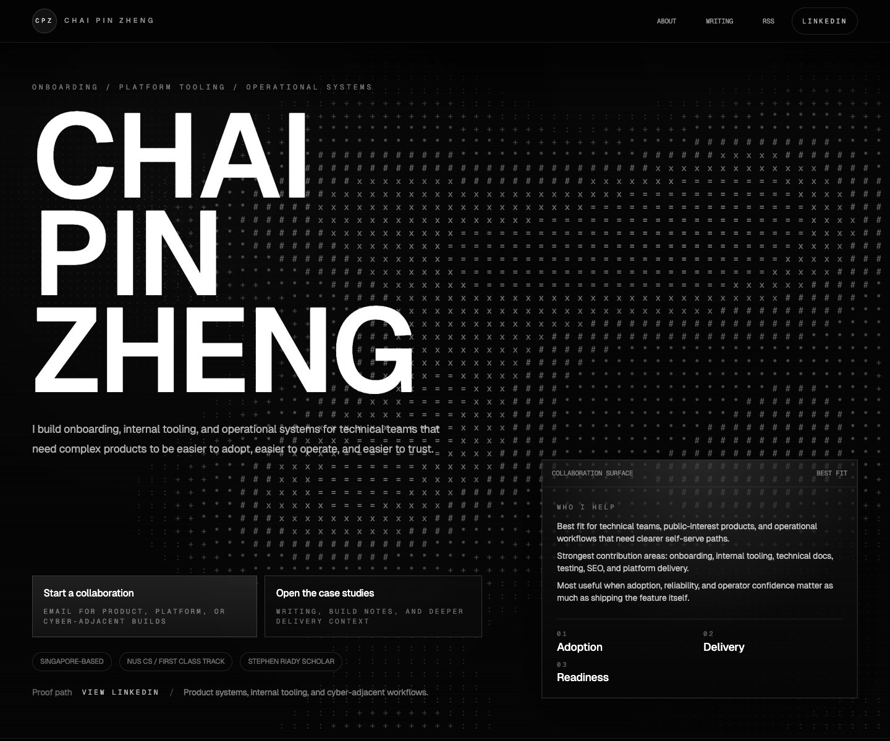
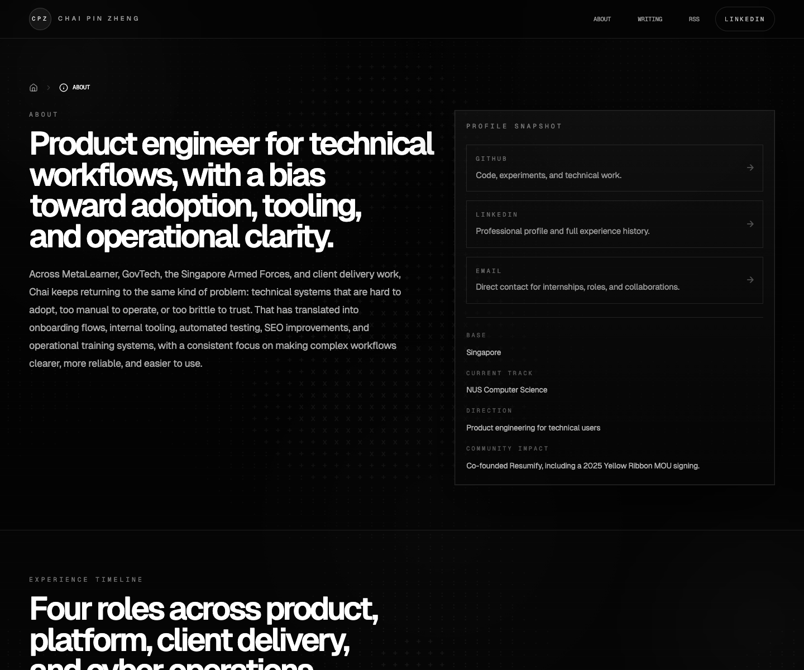
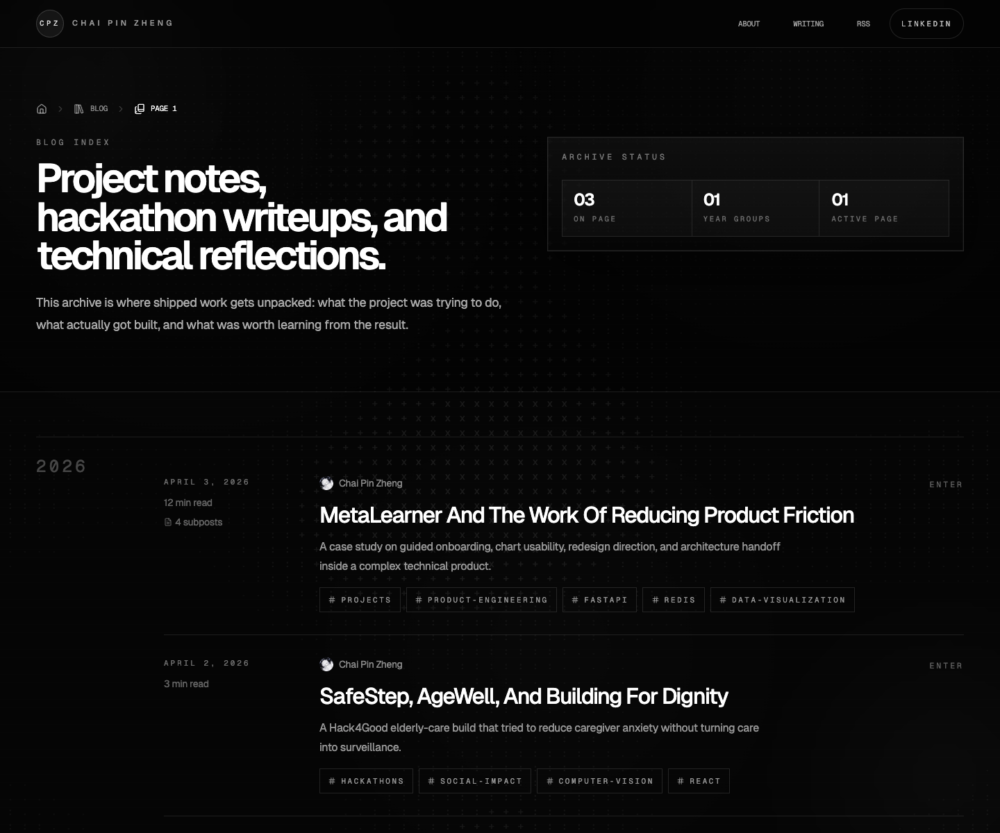

# Chai Pin Zheng

Portfolio and writing site for case studies, shipped work, and technical
reflections, built with Astro 6, Tailwind CSS 4, and MDX.

This repository powers a custom monochrome portfolio experience with an
immersive landing page, a case-study-driven about page, and a writing archive
for project notes, hackathon writeups, and implementation retrospectives. The
current site is a substantial theme, content, and information-architecture
rewrite of `astro-erudite`.



<p>
  
  
</p>

## Highlights

- Portfolio-first experience with an immersive monochrome landing page,
  case-study about page, writing archive, project listings, author pages, and
  tag pages
- MDX-powered publishing workflow for blog posts, project entries, and author
  profiles
- SEO-friendly setup with canonical URLs, sitemap generation, RSS output, Open
  Graph images, and favicon metadata
- Rich technical writing support with KaTeX, Shiki, Expressive Code, and custom
  callout components
- Light and dark theme support with reusable UI primitives and Astro islands
  for selective interactivity

## Tech Stack

- [Astro 6](https://astro.build/)
- [React 19](https://react.dev/) for interactive islands
- [Tailwind CSS 4](https://tailwindcss.com/)
- [MDX](https://mdxjs.com/)
- [Shiki](https://shiki.style/), [Expressive Code](https://expressive-code.com/), and [KaTeX](https://katex.org/)
- [Vercel](https://vercel.com/) for deployment

## Getting Started

### Prerequisites

- Node.js `22.x`
- npm

### Local Development

1. Install dependencies:

   ```bash
   npm install
   ```

2. Copy the example environment file:

   ```bash
   cp .env.example .env
   ```

3. Set `PUBLIC_SITE_URL` in `.env` to your production domain. For local work, a
   placeholder domain is fine.

4. Start the dev server:

   ```bash
   npm run dev
   ```

5. Open [http://localhost:1234](http://localhost:1234).

## Environment Variables

The site resolves its canonical URL in `src/lib/site-config.ts` using the
following order:

| Variable | When to use it | Notes |
| --- | --- | --- |
| `PUBLIC_SITE_URL` | Recommended for local and production use | Primary source for canonical URLs, sitemap entries, and RSS metadata |
| `SITE_URL` | Optional fallback | Useful if you prefer a non-public env name in deployment config |
| `VERCEL_PROJECT_PRODUCTION_URL` | Automatic on Vercel | Keeps preview deployments pointed at the production domain for SEO-safe metadata |
| `VERCEL_URL` | Automatic on Vercel | Last-resort fallback |

For `npm run dev`, the site falls back to `http://localhost:1234`. Production
builds intentionally fail fast if no site URL is configured.

## Available Scripts

| Command | Description |
| --- | --- |
| `npm run dev` | Start the local Astro development server on port `1234` |
| `npm run start` | Alias for `npm run dev` |
| `npm run build` | Run Astro checks and create a production build in `dist/` |
| `npm run preview` | Preview the production build locally |
| `npm run astro -- <args>` | Run Astro CLI commands directly |
| `npm run prettier` | Format `ts`, `tsx`, `css`, and `astro` files |

## Project Structure

```text
.
|-- public/
|   |-- fonts/
|   `-- static/
|-- src/
|   |-- components/
|   |-- content/
|   |   |-- authors/
|   |   |-- blog/
|   |   `-- projects/
|   |-- layouts/
|   |-- lib/
|   |-- pages/
|   `-- styles/
|-- astro.config.ts
|-- package.json
`-- README.md
```

## Content and Configuration

### Site-wide metadata

- `src/consts.ts` contains the site title, description, navigation links,
  profile copy, landing-page content, social links, and featured content
  counts.
- `src/lib/site-config.ts` resolves the canonical site URL from environment
  variables.

### Content collections

Content schemas are defined in `src/content.config.ts`.

- Blog posts live in `src/content/blog/`
- Author profiles live in `src/content/authors/`
- Project entries live in `src/content/projects/`

Example blog post frontmatter:

```mdx
---
title: 'Post title'
description: 'Short summary'
date: 2026-04-03
tags: ['astro', 'portfolio']
authors: ['chai-pin-zheng']
draft: false
---
```

Legacy posts carried over from the original `astro-erudite` template can stay in
the repo as writing or implementation references. Mark those entries with
`draft: true` so they are excluded from blog listings, RSS, and generated static
paths until you intentionally republish them.

Example author profile frontmatter:

```yml
---
name: 'Chai Pin Zheng'
avatar: '/static/logo.png'
bio: 'Project retrospectives, technical writing, and product engineering notes.'
github: 'https://github.com/Ducksss'
linkedin: 'https://www.linkedin.com/in/chai-pin-zheng/'
mail: 'chaipinzheng@gmail.com'
---
```

### Styling and assets

- Global tokens and theme styles live in `src/styles/`
- Favicons and static social assets live in `public/`
- Social preview graphics are stored in `public/static/`

## Deployment

This site builds to static output, so it can be deployed anywhere Astro static
sites are supported. Vercel is the intended hosting target for this repo.

Before deploying:

1. Set `PUBLIC_SITE_URL` to the production domain.
2. Run `npm run build`.
3. Verify canonical URLs, sitemap output, and RSS metadata use the expected
   domain.

## Credits

This site started from [astro-erudite](https://github.com/jktrn/astro-erudite)
by [jktrn](https://github.com/jktrn). The current repository is an extensive
theme, content, and information-architecture rewrite tailored to Chai Pin
Zheng's portfolio and writing archive.

## License

This repository includes the [MIT License](./LICENSE).
