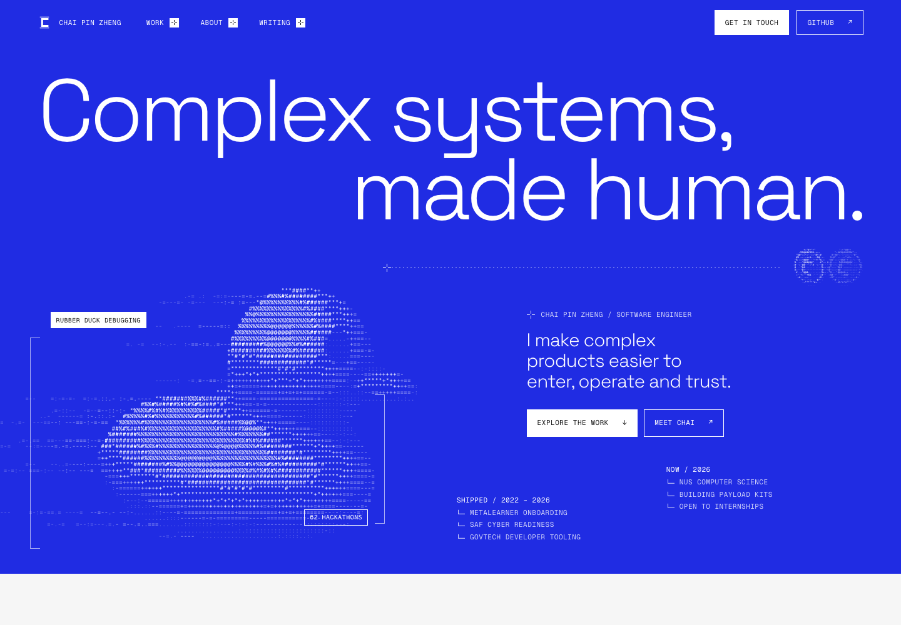
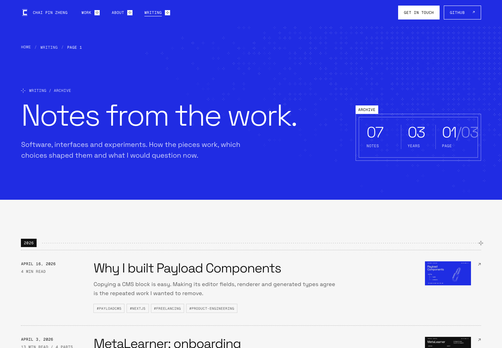

# Chai Pin Zheng

Portfolio and writing site for case studies, shipped work, and technical
reflections, built with Astro 7, Tailwind CSS 4, and MDX.

This repository powers an editorial portfolio with an ultramarine landing
page, a case-study-driven about page, and a writing archive for project notes,
hackathon writeups, and implementation retrospectives. Its visual language,
Signal / Noise, frames ASCII-rendered 3D objects and dithered textures with
hairline technical marks and light, oversized type; see [DESIGN.md](./DESIGN.md).
The current site is a substantial theme, content, and information-architecture
rewrite of `astro-erudite`.



<p>
  
  
</p>

## Highlights

- Portfolio-first experience with an electric-blue editorial landing page,
  case-study about page, writing archive, project listings, author pages, and
  tag pages
- MDX-powered publishing workflow for blog posts, project entries, and author
  profiles
- SEO-friendly setup with canonical URLs, sitemap generation, RSS output, Open
  Graph images, and favicon metadata
- Rich technical writing support with KaTeX, Shiki, Expressive Code, and custom
  callout components
- A three-surface design system (ink, ultramarine, paper) with ASCII objects
  ray-marched from signed-distance models at build time, textures that fade by
  dropping marks, and Astro islands for selective interactivity

## Tech Stack

- [Astro 7](https://astro.build/)
- [React 19](https://react.dev/) for interactive islands
- [Tailwind CSS 4](https://tailwindcss.com/)
- [MDX](https://mdxjs.com/)
- [Shiki](https://shiki.style/), [Expressive Code](https://expressive-code.com/), and [KaTeX](https://katex.org/)
- [Vercel](https://vercel.com/) for deployment

## Getting Started

### Prerequisites

- Node.js `22.12.0` or newer in the `22.x` release line
- npm

### Local Development

1. Install dependencies:

   ```bash
   npm ci
   ```

2. Copy the example environment file:

   ```bash
   cp .env.example .env
   ```

3. Set `PUBLIC_SITE_URL` in `.env` to your production domain. For local work, a
   placeholder domain is fine.

4. Start the dev server:

   ```bash
   npm run dev
   ```

5. Open [http://localhost:1234](http://localhost:1234).

## Environment Variables

The site resolves its canonical URL in `src/lib/site-config.ts` using the
following order:

| Variable                        | When to use it                           | Notes                                                                            |
| ------------------------------- | ---------------------------------------- | -------------------------------------------------------------------------------- |
| `PUBLIC_SITE_URL`               | Recommended for local and production use | Primary source for canonical URLs, sitemap entries, and RSS metadata             |
| `SITE_URL`                      | Optional fallback                        | Useful if you prefer a non-public env name in deployment config                  |
| `VERCEL_PROJECT_PRODUCTION_URL` | Automatic on Vercel                      | Keeps preview deployments pointed at the production domain for SEO-safe metadata |
| `VERCEL_URL`                    | Automatic on Vercel                      | Last-resort fallback                                                             |

For `npm run dev`, the site falls back to `http://localhost:1234`. Production
builds intentionally fail fast if no site URL is configured.

This fork uses `https://www.chai-pin-zheng.xyz` as its canonical URL. Set
`PUBLIC_SITE_URL` to that address in Vercel's Production and Preview
environments, then redeploy after changing it. An older Vercel domain can
otherwise remain in canonical links, the sitemap and RSS.

## Available Scripts

| Command                                   | Description                                                                                       |
| ----------------------------------------- | ------------------------------------------------------------------------------------------------- |
| `npm run dev`                             | Start the local Astro development server on port `1234`                                           |
| `npm run start`                           | Alias for `npm run dev`                                                                           |
| `npm run build`                           | Run Astro checks and create a production build in `dist/`                                         |
| `npm run check`                           | Run Astro and TypeScript diagnostics                                                              |
| `npm test`                                | Run the ASCII engine, ASCII generator, date and sitemap regression tests                          |
| `npm run test:build`                      | Check the generated routes, links, assets, RSS, and sitemap after a build                         |
| `npm run test:browser`                    | Check responsive design, keyboard navigation, TOC, and the ASCII island in Chromium after a build |
| `npm run verify`                          | Run tests, checks, production build, and production/browser regression tests                      |
| `npm run preview`                         | Preview the production build locally                                                              |
| `npm run astro -- <args>`                 | Run Astro CLI commands directly                                                                   |
| `npm run prettier`                        | Format `ts`, `tsx`, `css`, and `astro` files                                                      |
| `npx tsx scripts/capture-previews.ts`     | Regenerate the social card and README previews after `npm run build`                              |
| `npx tsx scripts/generate-blog-covers.ts` | Regenerate the seven ASCII blog covers from local fonts and text artwork                          |

Before the first browser test or `npm run verify`, install Chromium once:

```bash
npx playwright install chromium
```

Browser tests start and stop their own local production preview. GitHub Actions
installs Chromium and runs the same checks on Linux.

## Project Structure

```text
.
|-- public/
|   |-- fonts/
|   `-- static/
|-- src/
|   |-- components/
|   |-- content/
|   |   |-- authors/
|   |   |-- blog/
|   |   `-- projects/
|   |-- layouts/
|   |-- lib/
|   |-- pages/
|   `-- styles/
|-- astro.config.ts
|-- package.json
`-- README.md
```

## Content and Configuration

### Site-wide metadata

- `src/consts.ts` contains the site title, description, navigation links,
  profile copy, landing-page content, social links, and featured content
  counts.
- `src/lib/site-config.ts` resolves the canonical site URL from environment
  variables.

### Content collections

Content schemas are defined in `src/content.config.ts`.

- Blog posts live in `src/content/blog/`
- Author profiles live in `src/content/authors/`
- Project entries live in `src/content/projects/`

Profile content was reconciled with Chai's second brain on 3 October 2026.
Career and education use the current personal profile and saved product-design
CV. ReactorOS, Resumify, LaunchPad and The Collective use their project notes,
and client work preserves the collaborators credited in the LinkedIn archive.
Historical impact figures are source-reported, rather than fresh measurements.
The Devpost figures are a dated 14 September snapshot of joined events,
distinct projects and project-to-event submission links. Joined events include
registrations, and repeated submissions can reuse a project.

When refreshing the profile, update `src/consts.ts`, the author bio, project
entries and homepage current-work copy together, then run `npm run verify`.
Featured cards read each project's description and choose their illustration
by project ID, so changing the selection cannot attach another role's claims.
Use year-only dates when employment month boundaries conflict, keep expected
graduation marked as an estimate, and omit disputed award rankings. Retain
publication dates and URLs when correcting older articles, and add a dated
update note. Private evidence links and personal identifiers stay in the vault.

Example blog post frontmatter:

```mdx
---
title: 'Post title'
description: 'Short summary'
date: 2026-04-03
updated: 2026-10-03
image: './cover.png'
tags: ['astro', 'portfolio']
authors: ['chai-pin-zheng']
draft: false
---
```

Write for readers who want to understand the work. Explain a concrete mechanism
or decision, link to the relevant source, and distinguish implemented behaviour
from mock data, simulations and proposals. Do not turn a technology list or an
award into a claim about effectiveness. Keep personal memories specific rather
than filling gaps with a generic lesson.

The archive contains seven project and personal notes, with deeper chapters for
Beacon and MetaLearner. The former recruiter-writing guide and inherited
first-person template articles have been removed. The SAF chapters are combined
in one account. New drafts use `draft: true` until they are ready to publish.

Use `updated` when revising an existing post without changing its publication
date. It appears in the reading panel and supplies the modification date in
article metadata. ASCII covers are generated with
`npx tsx scripts/generate-blog-covers.ts` before building. Keep screenshots
readable when their interface details matter, and caption photos and prototype
screens without treating them as evidence of outcomes.

Publication dates and archive years use UTC so builds show the same calendar
date in every time zone. Subposts, author profiles, and tag detail pages remain
accessible but are excluded from the sitemap to match their `noindex` metadata.
Social previews use emitted PNG assets; SVG post artwork uses the default
raster preview image for compatibility with social platforms.

Example author profile frontmatter:

```yml
---
name: 'Chai Pin Zheng'
avatar: '/static/logo.png'
bio: 'Project retrospectives, technical writing, and product engineering notes.'
github: 'https://github.com/Ducksss'
linkedin: 'https://www.linkedin.com/in/chai-pin-zheng/'
mail: 'chaipinzheng@gmail.com'
---
```

### Styling and assets

- [DESIGN.md](./DESIGN.md) is the source of truth for the visual language:
  tokens, type roles, marks, imagery and composition rules. Read it before
  changing a page.
- Tokens live in `src/styles/global.css`; shared primitives (surfaces, type
  roles, marks, buttons, frames, tabs, tree lists, ASCII tones) live in
  `src/styles/system.css`; long-form reading styles live in
  `src/styles/typography.css`.
- Palette: ink `#101010`, ultramarine `#202ce3` and paper `#f6f6f6`, with
  greys derived from ink. Space Grotesk carries display and reading text, Mona
  Sans (condensed and expanded) the poster line and footer wordmark, and Geist
  Mono labels, data and code. All fonts are self-hosted.
- `src/lib/ascii` ray-marches signed-distance models (`duck`, `coin`, `bars`,
  `padlock`, `chain`, `cursor`) into dithered ASCII at build time.
  `<AsciiObject>` renders one as static text; `motion="sway"` or
  `motion="spin"` animates it in a Web Worker while it is on screen, and
  reduced-motion visitors keep the static frame.
- `src/lib/fields.ts` generates the cross grids, pixel blocks and wordmark
  dissolve as SVG masks, served from `/fields/*.svg`.
- Favicons and static social assets live in `public/`. Regenerate the social
  card and README previews with `scripts/capture-previews.ts`.
- Run `npm run build && npm run test:browser` to check representative routes
  at 1440, 768, 390 and 320px, section surfaces, overflow, body typography,
  keyboard skip navigation, client navigation, and the ASCII tool exports.

## Deployment

This site builds to static output, so it can be deployed anywhere Astro static
sites are supported. Vercel is the intended hosting target for this repo.

Before deploying:

1. Set `PUBLIC_SITE_URL` to the production domain.
2. Run `npm run verify`.
3. Verify canonical URLs, sitemap output, and RSS metadata use the expected
   domain.

## Upstream updates

Reviewed against upstream `astro-erudite` v2.0.1 at `1ffdf62` on 2 October 2026.
The Astro 7 migration follows the [official upgrade guide](https://docs.astro.build/en/guides/upgrade-to/v7/).
The custom ASCII theme, MDX, React islands, Tailwind, KaTeX, page URLs, and
content are retained. Upstream v2 replaces these systems, so its template
rewrite is not merged wholesale.

Markdown uses Astro 7's supported `unified()` processor with the existing
remark/rehype plugins. `compressHTML: true` preserves the previous inline
whitespace handling. Compatible date, code theme, Safari, and sitemap fixes
are included. TypeScript stays on 6 because Astro Check does not yet support 7.
The Astro formatter stays on 0.14.1 until the released Tailwind formatter
supports the newer Astro syntax tree.
The obsolete import-organising formatter plugin was removed because it
interferes with Tailwind class sorting.

Astro 7.3.5 currently emits a harmless `MODULE_LEVEL_DIRECTIVE` build warning
for its generated `use astro:head-inject` marker. The [upstream fix](https://github.com/withastro/astro/pull/18088)
is pending; the marker is unused, and production checks verify that MDX styles
and assets are still emitted. Other build warnings are not suppressed.

npm and `package-lock.json` are the dependency source of truth; use `npm ci`
for reproducible installs. The stale template `bun.lock` has been removed.
GitHub Actions runs `npm run verify` for pushes and pull requests.

To review future upstream changes without overwriting customisations:

```bash
git fetch upstream
git log --oneline HEAD..upstream/main
git diff upstream/main -- package.json astro.config.ts src/lib
```

Port applicable changes individually and run `npm run verify` before deploying.

## Credits

This site started from [astro-erudite](https://github.com/jktrn/astro-erudite)
by [jktrn](https://github.com/jktrn). The current repository is an extensive
theme, content, and information-architecture rewrite tailored to Chai Pin
Zheng's portfolio and writing archive.

## License

This repository includes the [MIT License](./LICENSE).
