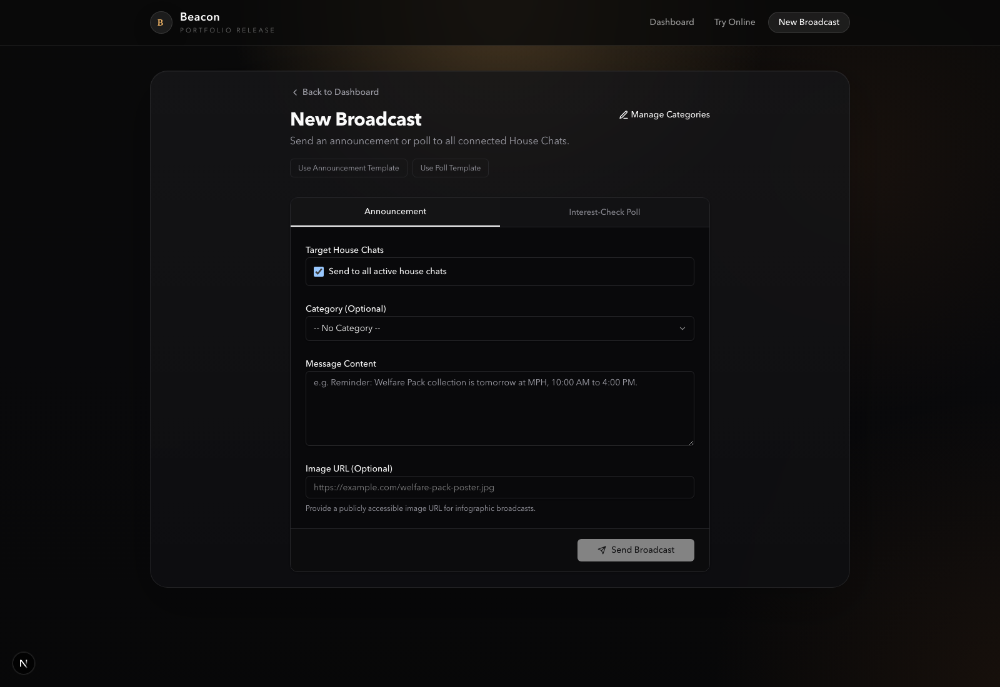
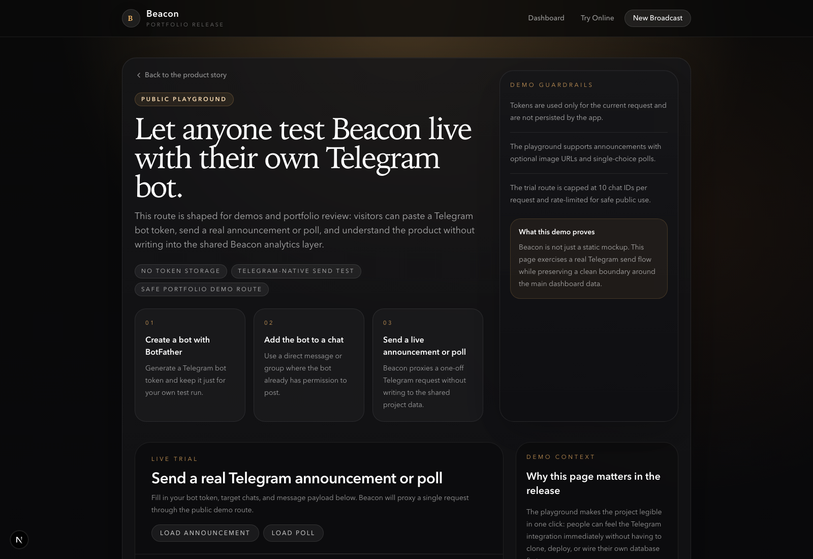

## Why Beacon Happened

I only had about an hour to put Beacon together, and I could feel the rush the entire time hahaha. Part of that was the usual hackathon adrenaline, but part of it was also because we absolutely did this to ourselves.

### Why it suddenly became real

The funny part is that we actually had way more time than that. We just kept procrastinating and telling each other, "yeah, we'll do it tomorrow," until tomorrow kept moving in the most unserious way possible. It only snapped into focus when Esther texted the group chat for the first time and asked whether it was still on. The moment that message landed, we all knew it was, and suddenly all of the fake tomorrow energy disappeared.

This was not one of those comfortable "let's explore a few ideas and polish the edges later" builds. This was me looking at the clock, locking onto one problem that felt real, and deciding that every feature had to earn its place immediately. If it did not make the demo more believable, it did not make the cut. I was not in the mood to be elegant. I was in the mood to survive.

## The Problem Was Small But Real

That constraint ended up helping more than it hurt. Instead of trying to build a giant campus operations platform, I focused on one clear workflow: committees needing to send announcements and polls across multiple Residential College house chats without manually forwarding the same thing over and over again. This is the kind of problem that sounds small until you actually imagine being the poor guy who has to forward the same message into five chats and then fix the typo in all five afterwards.

That idea became **Beacon**, a Telegram-powered outreach dashboard for RC committees and student leaders. The core pitch was simple:

- invite the bot into each house chat once
- send announcements or polls from one control surface
- collate the activity back into one dashboard

That was enough to feel like a product instead of a gimmick, which is exactly what I needed under hackathon pressure.

### The workflow that kept breaking

The problem landed for me because it was small enough to explain in one sentence and annoying enough that people immediately get it. I really like problems like that. They are not glamorous, but they are painfully human.

Student committees already live on Telegram. The issue is not that they lack a communication channel. The issue is that once communication fans out across several house chats, club chats, or inter-RC groups, the workflow gets ugly very quickly. One announcement has to be forwarded five times. One correction has to be repeated everywhere. One poll turns into scattered responses across multiple chats.

That gave me a product angle I could move on quickly: do not replace Telegram, just put a better control layer on top of it. I did not want to build some fantasy communication app that only works if everyone changes their behavior for the sake of a demo. That always feels fake to me.

## What I Chose To Build

### What made the cut

Because the timeline was absurdly short, I had to think less like a perfectionist and more like a demo editor. I was basically asking myself, "what has to exist for this to stop feeling like a toy?"

I prioritized the parts that made Beacon feel immediately understandable:

- a **dashboard** that looked like a real operator surface rather than a hackathon admin panel
- a **compose flow** that made announcements and polls feel like first-class actions
- a **Telegram delivery story** that explained why the product belonged on top of existing house chats
- a **centralized activity view** so the product had a visible feedback loop

I deliberately avoided trying to make Beacon look "complete" in every direction. The job was not to solve campus communications forever. The job was to prove that one clean workflow could work end to end. If I tried to do too much, the whole thing would start smelling like hackathon slop, and I really did not want that.

  

    
  

  

    
  

## Why The Demo Worked

### The story was easy to follow

The reason Beacon worked as a hackathon idea was that the story was very easy to follow. I did not need the audience to admire the architecture first. I needed them to immediately understand why this would be useful.

I could explain it in a straight line:

1. committees already communicate through Telegram
2. forwarding updates manually across multiple chats is messy
3. Beacon lets them broadcast once from a dashboard
4. polls and engagement come back into one central place

That gave the project a useful shape. Instead of being "a Telegram bot with some extra UI," it became a workflow product with a beginning, middle, and end. I care a lot about that difference. "Bot plus dashboard" is not a product story by itself. A legible loop is.

The live surfaces helped a lot too. The landing page framed the story, the dashboard made the operator experience feel tangible, and the public `/try` route made the whole thing feel less hypothetical.

## My Role In The Team

### What I personally drove

Beacon was a team submission, not a solo project. I worked on Beacon together with **Yu Hoe Tan**, **Esther Toh**, and **Anton Ang**.

For my part, I focused on the product concept, dashboard UX, Telegram workflow, and the overall end-to-end shape that made the demo legible fast. I cared a lot about making the system feel calm and understandable even though I was building it in a rush, which is a very me problem to have. Yu Hoe also worked on the backend infrastructure and data flow side, and the full submission was stronger because it was not resting on one person's hands alone.

In this write-up, I'm mostly talking about the parts I personally obsessed over: the framing, the workflow, and the technical choices that let Beacon feel coherent despite the time pressure. This is my blog, so I am obviously going to talk more about the parts that lived rent-free in my head.

## What Stayed With Me

### Clarity beat breadth

Beacon reminded me that under extreme time pressure, clarity beats breadth. I know that sounds like a tidy lesson, but I actually felt it very viscerally here.

I did not have time to make everything deep, but I did have time to make the central loop obvious. That was the right trade. Once a user can instantly understand where the product fits into their life, the rest of the system starts to feel credible much faster.

It also reminded me how much I enjoy building products around operational friction. A lot of useful software is not about inventing a brand-new behavior. It is about removing repetition, inconsistency, and avoidable mistakes from a workflow people already do every week. That kind of work is deeply satisfying to me because it feels both technical and unpretentious.

And honestly, I still remember the feeling of that one-hour sprint very clearly. I was rushing, laughing a bit at how little time I had, and still trying to make the output feel composed. That energy is part of why I like hackathons in the first place. They are a little stupid, a little glorious, and very good at revealing what you actually care about when time gets compressed.

## Read The Subposts

I split the deeper story into two follow-ups:

- one on how I made the workflow legible under hackathon pressure
- one on how I wired up the Telegram and Supabase stack fast enough for the idea to hold

If the parent post is the high-level story, the subposts are the "how I actually made this believable" part.

## Links

- [Live demo](https://beacon-telegram.vercel.app/)
- [Devpost submission](https://devpost.com/software/beacon-rc-announcement-bot?ref_content=user-portfolio&ref_feature=in_progress)
- [GitHub repository](https://github.com/ducksss/beacon)
