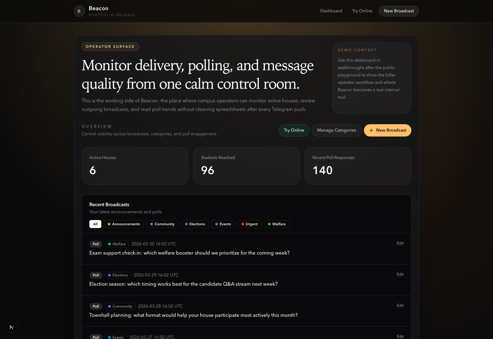

A Residential College committee might have one announcement to make and several house chats to reach. Someone forwards the message into each chat, checks that none were missed, then does it again if the time or venue changes. Polls add another chore because the answers end up spread across those same chats.

Beacon was our attempt to move that repeated work into one place. Students would keep using their existing Telegram groups, while the committee would compose a message once and choose where to send it.

## The hour we actually used

We had more time available, but kept postponing the build. Esther eventually messaged the group to ask whether we were still doing it, and that was the nudge that got us moving. My part of the hackathon build happened in roughly an hour.

I worked with **Yu Hoe Tan** and **Esther Toh** on the Student Life Track Hackathon 2026 submission. I focused on the dashboard and sending workflow, while Yu Hoe worked on backend infrastructure and data flow. The deadline left little room to explore alternatives, so we stayed with the problem we could explain and inspect: getting the same announcement into several existing chats.

## What sending once actually means

From the committee's side, there is one broadcast. From Telegram's side, there are separate messages in separate chats. That difference matters as soon as anything goes wrong.

```text wrap=false
                    +--> house chat A
committee --> Beacon+--> house chat B
                    +--> house chat C
```

If one chat rejects a message, the others may already have received it. If the committee corrects the announcement, Beacon has to find and edit each copy. A poll needs another layer of bookkeeping because every chat gets its own Telegram poll ID.

Those details made the project more interesting than the initial forwarding problem. The dashboard needed to remember the relationship between one committee action and all the messages it produced, rather than just provide a larger Send button.

<figure class="overflow-hidden border [&_img]:m-0">



<figcaption class="px-4 py-3 text-sm">The dashboard groups broadcasts and poll summaries in one view. The screenshot uses demo records, so its numbers are not evidence of student adoption or messages read.</figcaption>
</figure>

## What the prototype can show

The [repository](https://github.com/Ducksss/beacon) contains Telegram send routes for text, photos and single-choice polls, plus Supabase tables that link each broadcast to its chat-level copies. It also has a correction route for announcement text and photo captions, and a return path for poll answers.

That is code for the intended workflow, not evidence that we ran a reliable campus service. Delivery can partially fail, and a message arriving in a chat does not tell us whether anyone read it. The demo dashboard includes sample data, which makes it useful for explaining the interface but unsuitable for measuring the project's reach.

The repository also includes work added after the hackathon. Its [public playground](https://beacon-telegram.vercel.app/try) uses a visitor's own bot token and chat IDs to make one-off Telegram sends. Those sends do not feed the shared dashboard's broadcast history or poll summaries, so trying that page only exercises the outbound part of the system.

The two follow-ups look at different parts of the same problem: how the interface handles destinations, corrections and incomplete sends, then how the database connects distributed polls back to one question.

## Project links

- [Beacon demo](https://beacon-telegram.vercel.app/)
- [Hackathon submission](https://devpost.com/software/beacon-rc-announcement-bot)
- [Source code](https://github.com/Ducksss/beacon)
