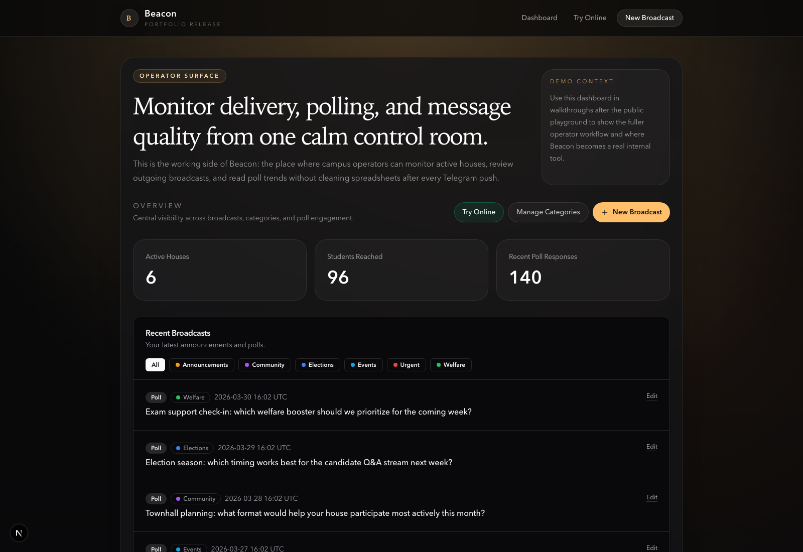
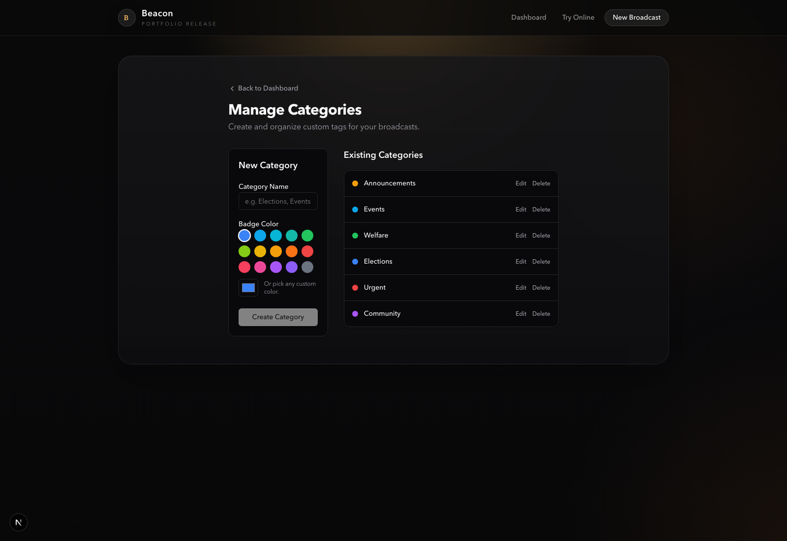

## The stack had to hold the story together

Beacon came together in about an hour, so I was not trying to design the perfect architecture. I was trying to build a stack with good enough edges that the dashboard, Telegram delivery, and poll summaries would all feel real.

### What I needed from the stack

That meant I cared about a few things more than everything else:

- the dashboard had to feel responsive and coherent
- Telegram delivery had to sound real, not hand-wavy
- poll data had to flow back into something centralized
- the stack had to be simple enough that I could reason about it quickly

That pushed Beacon toward a very practical setup: **Next.js + React** for the app surface, **Telegram Bot API** for delivery, and **Supabase** for storage and backend state. Boring in the right places, which I mean as a compliment.

## Start With The System Shape

At a high level, Beacon worked like this:

```text
Committee operator
  -> Beacon dashboard
  -> Next.js API route
  -> Telegram Bot API
  -> Target house chats

Telegram updates / poll activity
  -> webhook handler
  -> Supabase records
  -> dashboard analytics + history
```

### Control plane, execution layer, memory

I liked this shape because it kept the whole system easy to explain. The dashboard was the control plane. Telegram was the execution layer. Supabase was the memory. If I cannot explain the system cleanly, I start distrusting it a little.

## The Interface Could Not Feel Fake

### Why the dashboard mattered

A lot of messaging tools die at the moment they start feeling like a raw admin panel. I did not want Beacon to feel like that. The second the interface feels fake, the whole product starts collapsing in my head.

The dashboard had to sell the idea that committee communication could be calm, organized, and centralized even if the delivery still happened across decentralized chats. So I treated the interface as part of the architecture, not just decoration. I care a lot about that because UI is very often the part that tells you whether the backend idea is actually believable.

The dashboard gave Beacon a place to show:

- connected houses
- recent broadcasts
- activity and poll summaries
- categories that made outreach history understandable

Without that surface, the product would have collapsed back into "just a bot."

<div class="grid grid-cols-1 gap-4 [&_img,p]:m-0">
  <div class="overflow-hidden rounded-lg border">
    
  </div>
  <div class="overflow-hidden rounded-lg border">
    
  </div>
</div>

## Telegram Forced Certain Decisions

### What the platform constrained

One of the most useful things about building on top of Telegram is also one of the most annoying: it gives you a real distribution surface, but it absolutely does not let you ignore its rules. Which is good, honestly. It forces the product to stop lying.

That shaped several decisions:

- announcements and polls needed different handling
- sent content had to be logged so the dashboard could stay grounded in reality
- edits had to respect what Telegram actually allows after a message is live
- poll activity had to be mapped back from multiple chat instances into one Beacon-level view

This is the part I find interesting in products like Beacon. The product is only credible if the admin surface and the external platform stay in sync. Otherwise the UI is lying. And if the UI is lying, then the whole thing starts feeling like cosplay software.

## Poll Collation Was The Core Trick

### One broadcast, many distributed poll instances

The most product-defining backend problem was poll collation. This was the part that made Beacon feel like an actual system to me rather than a one-way sending tool.

A single Beacon poll broadcast could create multiple Telegram poll instances, one per house chat. If I wanted the dashboard to feel useful, I could not leave those as isolated chat artifacts. I needed a way to treat them as one campaign with many distributed copies.

So the right mental model was:

- one **master broadcast**
- many **chat-level deliveries**
- many **poll instances**
- one **centralized summary**

That is where Supabase helped a lot. It gave Beacon a place to log the outgoing broadcast, store chat mappings, and relate poll responses back to a common source of truth. That is the kind of boring infrastructure work that makes a demo feel much less fake. I actually like this kind of boring when it is attached to a clean product idea.

## Why Supabase Worked

Supabase was the right choice for the speed of this build because it let me move without inventing too much infrastructure from scratch. I did not want to waste precious time pretending I was above using tools that make this easier.

I needed:

- a database I could shape quickly
- an easy way to persist broadcasts, chats, and committee state
- a backend-friendly place for the dashboard and webhook flow to meet

That is exactly the kind of job Supabase is good at in a hackathon setting. It let the architecture stay lightweight while still giving Beacon enough structure to support real workflow logic.

## What I Wired First

The main technical decisions were all in service of the same goal: make the system believable as quickly as possible. I was not trying to win points for complexity. I was trying to make the whole thing hold together without wobbling.

I wired up:

- dashboard routes because the product needed an operator surface
- Telegram send flows because the idea falls apart if delivery is vague
- webhook handling because the product needed a return path, not just outbound messaging
- poll collation because centralized visibility is the whole point
- category and history support because they made the interface feel like an actual working system

I was definitely feeling the rush while doing it, but that helped me keep the implementation honest. I only had time for the parts that strengthened the loop. Weirdly enough, that made me trust the final shape more, not less.

## What I'd Add Next

If I were extending Beacon beyond hackathon speed, the next steps are pretty clear:

- stronger role-based access control
- scheduling for planned campaigns
- richer analytics across houses
- smoother onboarding for bot setup and chat registration
- more robust media and asset workflows

But for the one-hour version of Beacon, the architecture did what it needed to do. It held the product story together, and that was the real job.
