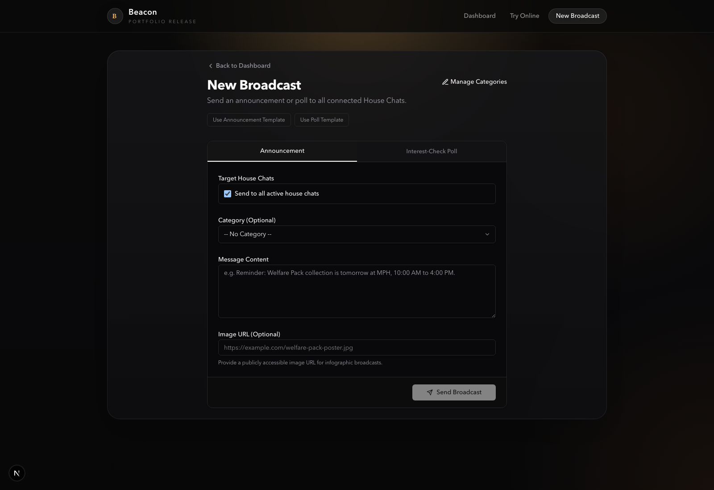

Sending an announcement to several chats makes the button easy to design and the result harder to explain. A committee needs to know which chats it selected, whether the messages arrived and what happens if the announcement needs a correction.

Beacon's compose screen puts those decisions together. It offers announcements or interest-check polls, a destination selector and an optional category. The category helps find the broadcast later, while the destination selector determines who actually receives it.

## Choosing the destinations

The prototype defaults to all active house chats and also allows a selected subset. The bot's membership updates populate the house list, so joining or leaving a Telegram chat changes whether Beacon treats it as active.

Active is a useful starting point, but it is not a delivery guarantee. It records the bot's membership state, while the attempt to send still has to succeed. This is why a destination list and a send result answer different questions.

<figure class="overflow-hidden border [&_img]:m-0">

<figcaption class="px-4 py-3 text-sm">The announcement form keeps recipients beside the content. Images are supplied through a URL rather than an upload flow.</figcaption>
</figure>

## A broadcast can partly succeed

Suppose the committee sends to three chats and one rejects the request. The other two messages can already be live. Reporting the whole broadcast as failed would hide those deliveries, while reporting it as successful would hide the missing copy.

The [send route](https://github.com/Ducksss/beacon/blob/cfaabc3612e15506dfa7f89d6ab99efe12b5d91f/web/src/app/api/broadcast/route.ts) waits for each attempt independently and returns successful and failed counts. The compose screen shows both. This is a useful distinction, although the prototype stops short of a durable record of every failed destination or a retry action for just those destinations.

A failed count also has a subtle meaning here. Beacon counts an attempt as successful only after Telegram accepts the send **and** the database stores its identifiers. If that database write fails, a message may exist in Telegram despite being counted as failed. Sending the whole broadcast again could therefore create duplicates.

## Corrections need the original message IDs

If an event moves from 7 pm to 8 pm, the committee should be able to correct the messages people already received. Beacon stores each announcement's chat ID and message ID for that purpose. The [correction route](https://github.com/Ducksss/beacon/blob/cfaabc3612e15506dfa7f89d6ab99efe12b5d91f/web/src/app/api/broadcast/%5Bid%5D/route.ts) edits the text of an ordinary message or the caption of a photo.

The prototype has an important gap: it attempts all those edits but discards the individual failures before updating the database. The dashboard can consequently show the corrected text even if one Telegram copy still has the old time. The interface's Edit button demonstrates the mechanism, but it does not yet provide confirmation that every copy agrees.

## Reading the dashboard honestly

Categories make the history easier to browse, and poll summaries bring responses from several chats into one view. Neither feature tells us how many people read an announcement.

The [dashboard API](https://github.com/Ducksss/beacon/blob/cfaabc3612e15506dfa7f89d6ab99efe12b5d91f/web/src/app/api/dashboard/route.ts) currently fills the **Students Reached** field with a count of distinct Telegram users in the vote records. That measures people who answered recorded polls, not everyone who saw a message. The public demo also has seeded and fallback records, so a large number on screen is not an adoption figure.
