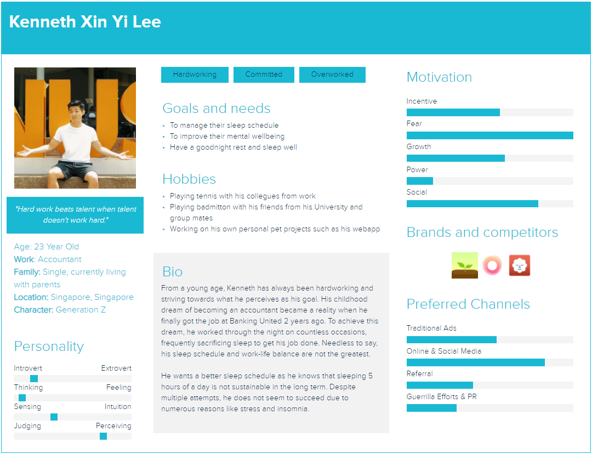
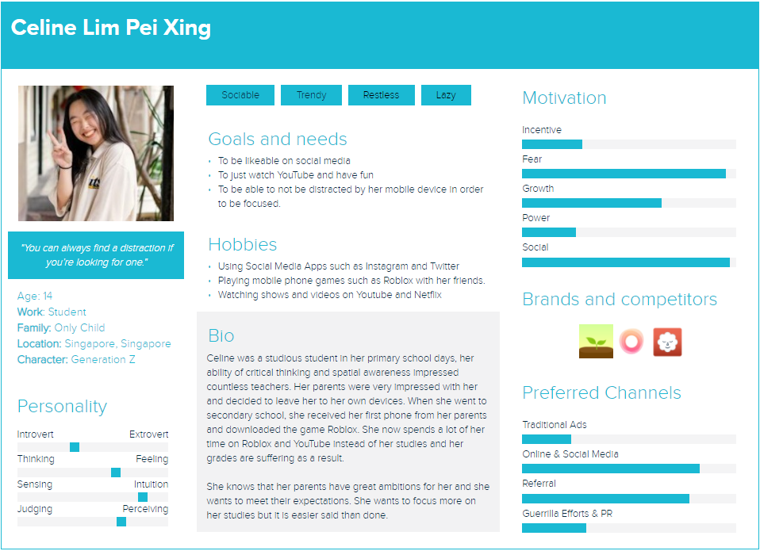
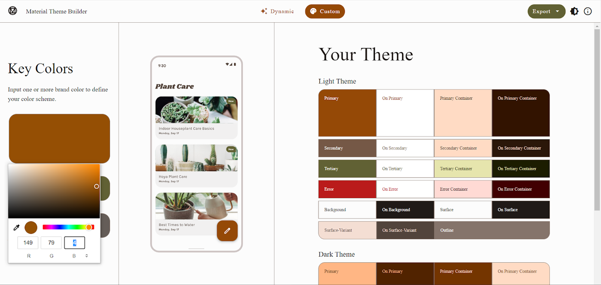
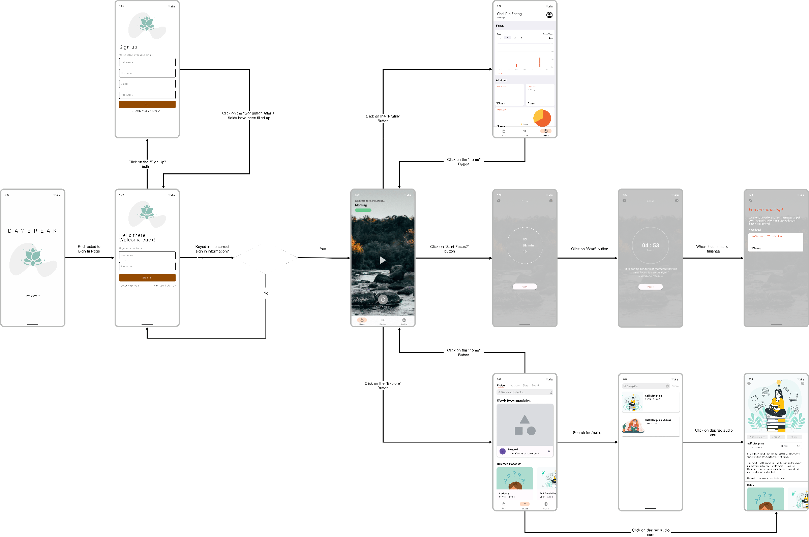
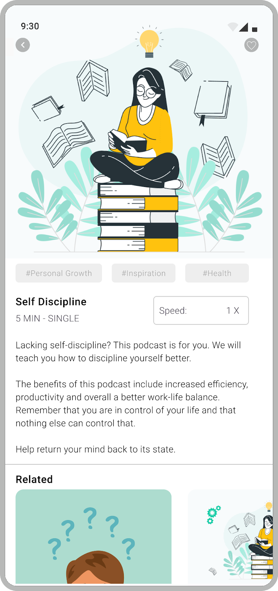
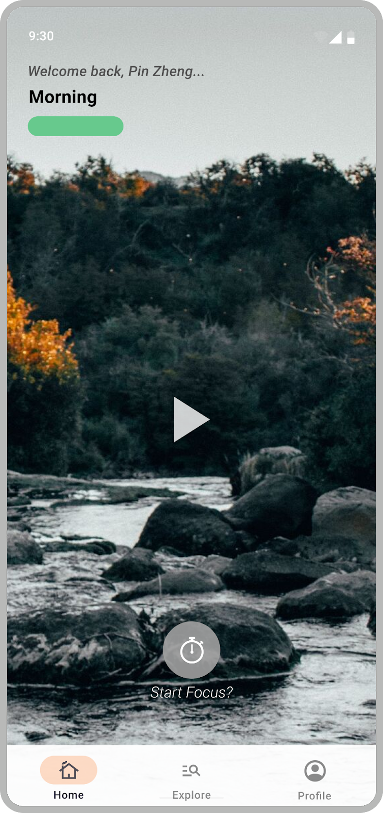
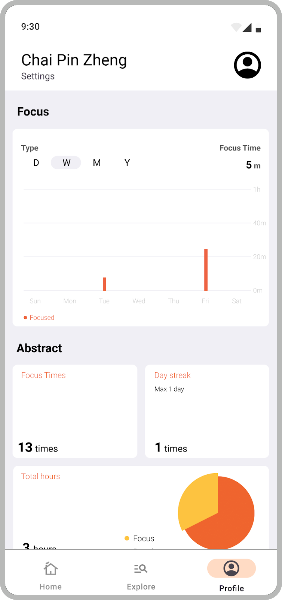
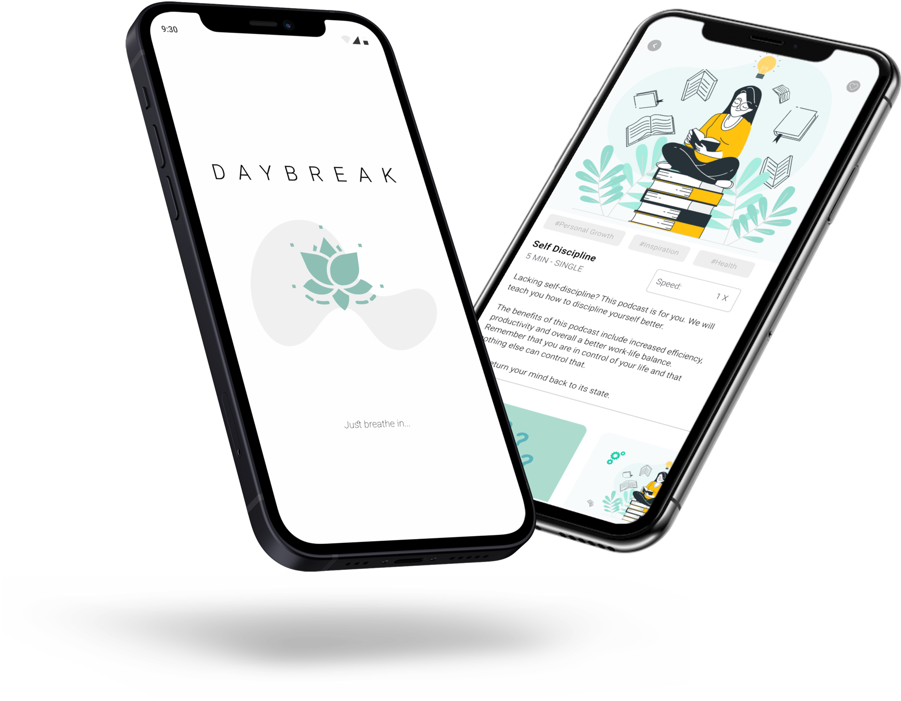

Daybreak gave us two personas, a moodboard, a Firebase-backed auth flow, and one harder product question than "should we build a meditation app?"

If a product says it wants to reduce mental clutter, does the interface itself actually behave that way?

That was the real center of the project. The app mattered, but the stronger constraint was that it had to feel calmer than the problem it was trying to solve.

## Why we chose this direction

We did not start with "let's build a meditation app."

In the original project write-up, I mentioned that we explored other directions first, including a medication app and a study-focused social product. Daybreak won because the problem felt immediate to everyone on the team. Staying focused was hard enough already, and it was obvious that technology was often making that worse instead of better.

We backed that instinct with user research. One of the sources we cited at the time reported that 49% of 478 students and 36 instructors said technology outside work or school was distracting. That was enough to give the app a clear center. We were not trying to build a generic wellness product. We were trying to make something that helped people slow down, refocus, and get through the day with less mental clutter.

## Research before screens

This is still my favorite part of the project.

Before we got deep into implementation, we did the product work first. The old Daybreak page still shows the sequence clearly: user studies, personas, a moodboard, a color palette exercise, and a simple flow diagram before the app build really took shape.

We even created two personas, Kenneth and Celine, to force ourselves to think about actual user pain points instead of designing for an abstract "mindfulness user." That mattered more than I knew at the time. Calm is surprisingly easy to get wrong in software. The wrong palette, the wrong density, or the wrong screen order can make the app feel more agitating than the problem it is meant to solve.

  

    
  

  

    
  

So a lot of the early thinking was really about tone. We deliberately leaned toward softer, more muted visual choices because we wanted the app to feel steady, not piercing. That sounds simple, but it was one of the first times I saw how product intent had to show up in interface decisions, not just in a pitch sentence.

The flow work mattered just as much. We were already mapping how someone would move from onboarding into actual use, which kept the app from becoming a pile of disconnected screens.

## What the app actually shipped

Reopening the repo, I was happy to see that Daybreak was more than a few static mockups.

The authentication flow was real. `LoginActivity.java` handled sign-in with Firebase Auth, `SignupActivity.java` created accounts and wrote user data into Firebase Realtime Database, and `VerifyEmailActivity.java` sat between signup and the rest of the product so email verification was part of the experience instead of an afterthought.

After that, `MainActivity.java` dropped the user into a bottom-navigation app with Home, Explore, and Profile surfaces. The home screen in `HomeFragment.java` tried to feel personal in small ways: it greeted the user by name, changed the message based on time of day, rotated ambient video backgrounds, and overlaid short motivational quotes. There was also a clear `Start focus...` path into `TimerActivity.java`, which broke the timer flow into separate fragments for selecting a session, continuing it, and ending it.

The explore side had more range than I remembered. `ExploreFragment.java` exposes five tabs: Explore, Single Series, Meditation, Selected Mix, and Selected Story. The strings file fills those sections with meditation series, seasonal ambience collections, long-form sound mixes, and even story content like Cinderella and Jack and the Beanstalk. It was a small content system, but it gave the product more shape than a one-screen demo.

  

    
  

  

    
  

  

    
  

## Trying to make it feel like a real product

One thing I still respect about this build is that we were not satisfied with making it look finished. We were trying to make it feel product-shaped.

The stack was classic Android for the time: Java, Android Studio, Material components, view binding, navigation, and Firebase. But the dependency list also shows where our heads were at. We pulled in Stripe, Google Mobile Ads, AnyChart, and other libraries because we were already thinking about premium flows, monetization, and what the app might need if it grew past a classroom exercise. There is even a paid confirmation modal that tells the user they are now a premium member.

Not every part of that system was equally mature, and that is fine. What matters to me now is the instinct behind it. Even early on, I was less interested in building isolated screens than in asking what would make the whole thing feel believable.

## What stayed with me

Daybreak is rougher than my later work, but the throughline is already there.

I care a lot about products that reduce mental effort. In Daybreak, that showed up as calmer visual choices, cleaner flow design, lightweight personalization, and a deliberate attempt to make the interface support the emotional goal of the product. Later projects moved into very different domains, but that underlying question never really changed.

How do you make a system feel clearer, steadier, and easier to trust?

That question was already visible in Daybreak. The tools were just smaller, and I was still learning how to use them.

## Links

- [Original project write-up](https://ducksss.github.io/Chai-Pin-Zheng/#/Chai-Pin-Zheng/Daybreak)
- [GitHub repository](https://github.com/Ducksss/Daybreak)
