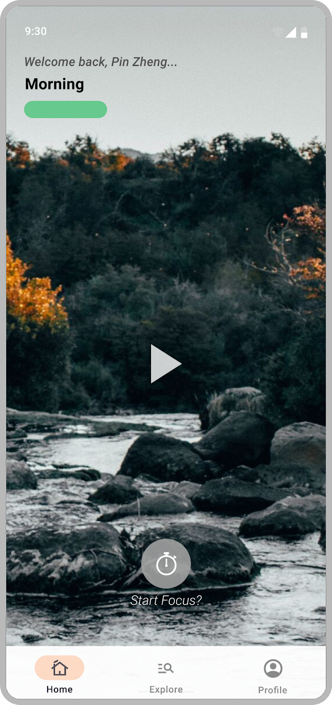

Daybreak was an early Android project built around meditation, ambient sound and a focus timer. We wanted a place to slow down, but looking at the app again, the useful part is more specific: a person could open the home screen, choose a duration and begin a session without browsing the content library first.

The soft colours and nature footage helped establish the mood. They did not settle the harder questions about what the app asked people to do, or what it claimed to know afterwards.

## The path into a session

The home screen had a greeting, ambient video and a prominent **Start focus** action. The greeting pulled a name from Firebase and changed with the time of day. Those were small touches, while the start button led directly into the timer.

<div class="my-6 flex flex-wrap justify-center gap-4 [&_img,p]:m-0">
  <div class="max-w-3xs border">
    
  </div>
  <div class="max-w-3xs border">
    
  </div>
  <div class="max-w-3xs border">
    
  </div>
</div>

_Onboarding, home and profile screens from the project. The home screen offers a direct route into focus, while the profile introduces the separate question of how a session is counted._

The [timer implementation](https://github.com/Ducksss/Daybreak/tree/3082ff86dd5281d6ab8479cb51fa952779eaa0ba/app/src/main/java/com/example/daybreak/Timer) used Android's own `NumberPicker`, with a range of one to 120 minutes. An activity-scoped `ViewModel` carried the selected duration between three fragments: selection, countdown and ending.

```text wrap=false
Home -> choose minutes -> countdown -> end screen -> Home
```

That made the interface easy to follow. Selection asks for one decision, the countdown shows time remaining and a progress ring, and the ending gives someone a way back. There was no need to choose a programme, read a description or commit to a longer course before starting.

## Browsing was a different task

The Explore section took the opposite approach. It had five tabs covering series, meditation, mixes and stories, with horizontal card lists and detail pages. That made sense for someone looking around, but it also created more choices than the timer needed.

Keeping those paths separate was a useful decision. Someone who already knows they want ten quiet minutes should be able to start, while someone looking for something to listen to can browse.

The catalogue was still a prototype. In the [detail activity](https://github.com/Ducksss/Daybreak/blob/3082ff86dd5281d6ab8479cb51fa952779eaa0ba/app/src/main/java/com/example/daybreak/InnerExploreActivity.java), the card supplied its title, description and artwork, but playback used the same bundled background track. Different cards made the library look varied without representing a complete library of different recordings.

That distinction matters when describing an old project. The screens show the intended experience, while the playback code shows how much of it existed.

## What counted as finishing

The timer also reveals a small but consequential mismatch between the interface and the data.

When the countdown reached zero, it displayed **Done!**. The user could also press the end button to open the ending screen early. Opening that screen incremented a local `focusamount` value in `SharedPreferences`, regardless of how much time had elapsed.

So the count recorded visits to the ending screen, rather than completed focus sessions. Recreating that screen could increment it again. A tidy number on a profile page can look more meaningful than the event behind it.

If I were revisiting the timer, I would first define what counts: a session started, time actually spent, or a session completed. Then I would record that event once and label it accordingly. The countdown would also need to survive normal Android lifecycle changes before its history could be relied on.

Those are modest changes, but they do more for a focus app than adding another statistic. A calm interface needs predictable behaviour as well as a quiet palette.

## Looking back at the prototype

Daybreak included real Firebase account creation, sign-in and email-verification checks. It was more than a set of mockups, but I would not describe it as a finished wellness product or use its counters as evidence that it improved concentration.

The part I would keep is the short route from wanting a break to beginning one. The part I would reconsider is everything that adds an obligation around it: an account before a simple timer, a large catalogue without distinct recordings, or a progress number whose meaning is unclear. A few minutes of quiet should not require much administration.

## Project links

- [GitHub repository](https://github.com/Ducksss/Daybreak)
- [Original project write-up](https://ducksss.github.io/Chai-Pin-Zheng/#/Chai-Pin-Zheng/Daybreak)
