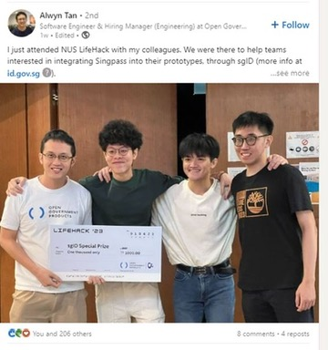

## The product clicked because it showed up at the right moment

EcoCart became a winning project once we reduced it to one useful moment: show the environmental cost of online shopping while the person is still deciding what to buy.

That turned the idea into **EcoCart**, a sustainable shopping companion with two parts:

- a browser extension that could live close to the shopping flow
- a dashboard web app that could show impact, progress, and alternatives more clearly

The project ended up winning **LifeHack 2023** and the **SGID Award** because the story was legible fast: surface the tradeoff in-context, then give the user somewhere deeper to go afterward.

## The Idea

### The problem we were trying to solve

The starting point was pretty simple. People shop online all the time, but the environmental consequences of what they buy are mostly invisible. Even if someone genuinely wants to make a better choice, the burden is still on them to leave the page, do extra research, compare alternatives, and figure out what the information actually means.

That felt wrong to me.

I did not think the answer was to build yet another sustainability dashboard that people only open after everything is already done. By then, the interesting moment is over. So the thought process became: how do we move closer to the decision itself?

### Why we split it into two surfaces

That gave us a clearer product shape very quickly. Instead of building one big app that tried to do everything, we split the experience into two surfaces:

- the extension would show up where the purchase was happening
- the dashboard would give the user the fuller story afterward

I liked that split because it gave the project a believable flow. It was not just "AI plus sustainability." It was a product that could meet the user in context and then support them more deeply afterward.

## My Part In It

### How we split the team

There were three of us, and the split helped a lot. **Kei Lok** focused on frontend engineering and UI/UX design, **Yu Hoe** handled the AI and backend side, and I worked on the **frontend** and the **web extension**.

### Why the extension was the interesting part for me

For me, the extension was the most interesting part.

The challenge was not only making it work. The challenge was making it feel like it belonged inside a real shopping flow. If the extension was too clunky, too slow, or too disconnected from what the user was looking at, the whole product would start to feel like a school project pasted on top of an e-commerce site.

So a lot of my thinking went into immediacy:

- how do we make the information appear at the right moment
- how do we keep it understandable without overwhelming the user
- how do we make the experience feel helpful instead of preachy

That last part mattered to me. I never wanted the product to feel like it was scolding the user. The better version was something that helped them see a tradeoff clearly and then gave them a better next step.

## The Build

### What we actually shipped

The final build covered more ground than people might expect from a hackathon project. Based on the public repo, the stack included **Next.js**, **Chrome Extension Manifest V3**, **Supabase**, **AWS**, **Docker**, **Netlify**, **Tailwind CSS**, **OpenAI API**, and **SGID**.

On paper that sounds like a lot, but it did fit the project:

- **Next.js** gave us a fast way to build the dashboard
- the **Chrome extension** let us sit inside real shopping behavior
- **Supabase** gave us a backend foundation without too much setup friction
- **OpenAI** helped turn raw information into something more useful and readable
- **SGID** made the project feel more credible as something that could extend beyond a one-weekend prototype

What I liked most was that the build had a real product loop behind it. The extension handled the in-the-moment part. The dashboard handled the reflective part. Together, they made the idea feel much more complete than if we had only built one side.

### The product loop we kept protecting

The part we kept protecting was the handoff between the two surfaces. The extension made the tradeoff visible while the choice was still live. The dashboard gave the user a place to understand patterns, track impact, and keep engaging with the idea after the purchase moment had passed. That handoff was what made the project feel like a product instead of a single feature.

## The Hackathon Constraint

### What had to feel real in the demo

The biggest constraint was time, which is obvious, but the real problem was deciding what deserved time.

Once we had the core idea, we kept coming back to a simple question: what absolutely has to feel real in the demo?

That question helped us cut through a lot of noise. We did not need to solve everything about sustainable commerce. We needed to show a believable flow:

1. a user is shopping
2. EcoCart appears at the right moment
3. the product makes the hidden cost easier to understand
4. the user sees that a better choice is possible

That was the story. Everything else had to support it.

I think that helped us avoid a common hackathon trap, which is building a lot of disconnected clever features. We still had technical ambition, but we were not adding things just to sound impressive. We were trying to protect the clarity of the demo.

## Why It Landed

### Why the judges could understand it quickly

Looking back, I do not think EcoCart worked because it used a long list of technologies. I think it worked because the idea was easy to explain and the demo made immediate sense.

There were a few reasons for that:

- the problem was real and easy to understand
- the extension made the product feel present in the right place
- the dashboard made it feel like more than a gimmick
- the whole thing told one clear story instead of four unrelated ones

That mattered a lot in a judging setting. Judges see many projects in a short amount of time. If they have to work too hard to understand what the product is trying to do, you are already losing ground. EcoCart had a cleaner sentence behind it, and I think that helped us.

It also helped that I genuinely believed in the timing of the product. To me, the strongest part of EcoCart was never just that it could generate information. It was that it could surface the information while the choice was still live.

_One of the moments from LifeHack 2023 after presenting EcoCart._

## What Stayed With Me

### What this clarified for me

This project made something click for me quite early: I really like building products that sit between technical capability and human behavior.

I liked the frontend side of EcoCart, and I liked working on the extension itself, but the deeper thing I liked was shaping when and how the product entered the user's flow. That is still something I care about now. A technically strong system becomes much more interesting to me when it is also well-timed, legible, and easy for someone to act on.

EcoCart was one of the first projects where I felt that clearly. It was not just a hackathon build that happened to win. It was an early sign of the kind of work I wanted to keep doing.

## Links

- [Devpost submission](https://devpost.com/software/ecocart-rkmcjg)
- [GitHub repository](https://github.com/keiloktql/LifeHack2023-EcoCart)
