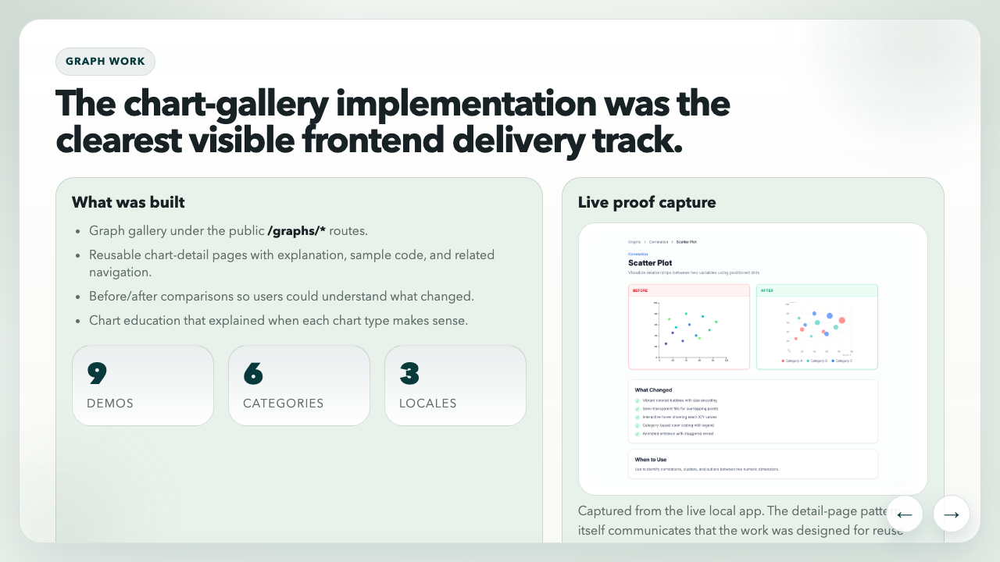
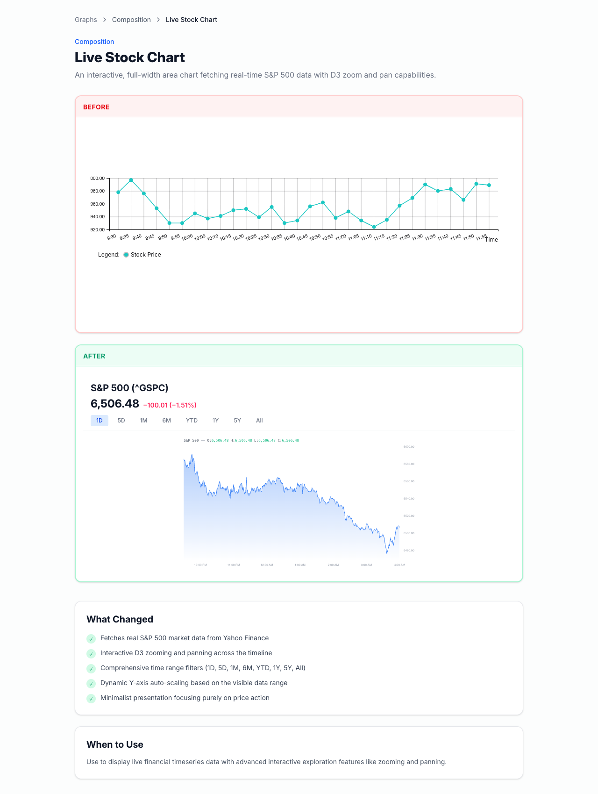

The chart-gallery implementation was the clearest visible frontend delivery track in MetaLearner.

I like framing it that way because it avoids underselling what the work was. This was not one chart polish pass. It was a reusable chart-detail system, a clearer information-design layer, and one of the easiest places for someone outside the team to see the difference between "the product has charts" and "the product helps users read data."

## The graph gallery was more than a demo

The implementation I handed over included an interactive chart gallery under the public `/graphs/*` routes. I shared the implementation with Lim as a zip, and the public proof of the work is the [demo video](https://www.youtube.com/watch?v=vEYGuY5jr-U).

The handoff site gives the scope cleanly: **9 demos**, **6 categories**, **3 locales**.

Each chart page was built to do more than render a visualization. It included:

- a **live demo**
- an **explanation** of what the chart was doing
- **sample code**
- **related navigation**
- **before/after comparisons**
- chart education explaining **when each chart type makes sense**
- routing and content that were **set up to be i18n-ready**

That structure mattered because it turned the gallery into a teaching surface as well as a product surface. A chart page was not just there to look impressive. It was there to show the behavior, explain it, and make the implementation easier to reason about.

_The graph-work slide made the gallery legible as a system, not just a collection of demos: reusable detail pages, before/after framing, chart education, and multilingual structure._

## The interaction layer mattered

The best proof of depth in the gallery was the final chart in the demo. It supported zoom and hover interactions so users could inspect time-series data more closely instead of just reading a static picture of it.

That kind of interaction matters more than people sometimes admit:

- **hover states** give users exact values and local context
- **zoom** gives dense data room to breathe
- **legends and cues** reduce visual guesswork
- **responsive behavior** determines whether the chart still makes sense on smaller screens

The handoff deck also calls out the details that made the charts feel more mature:

- better legends and more intentional colour palettes
- cleaner tooltips with clearer emphasis
- improved hover behavior and cursor tracking
- better guidance on what each chart type is good for

What I like about this kind of work is that it sits right on the border between interface design and trust. If a chart is hard to inspect, the product feels less reliable even when the underlying data is correct.

## There was real frontend depth underneath the polish

Looking back through the handoff site helped me see how much of this track was actually system work.

According to the implementation summary, the chart gallery was driven by:

- structured **config** rather than one-off pages
- reusable **routing** for gallery and detail views
- **D3** for chart behavior
- **Framer Motion** for transitions
- an i18n-ready content model supporting **English, Spanish, and Portuguese**
- a stack including **TypeScript**, **TanStack Router**, and **i18next**

The live stock chart pushed that further. It was not only animated. It used `/api/yfinance`, supported zoom and hover inspection, and handled dynamic scaling on a real time-series surface. That made it a useful proof point for other MetaLearner contexts, not just a gallery showpiece.

_The live stock chart is still the strongest single proof-of-depth example in the gallery: zoomable, hoverable, dynamically scaled, and connected to a real data fetch rather than a static placeholder._

## Why the mobile work belongs in the same conversation

The graph work was not isolated from the rest of the frontend. It sat alongside broader mobile-friendly layout improvements in the MetaLearner frontend repo. That mattered because dense information gets even more fragile once the screen gets tighter.

I do not think of responsive work here as cosmetic polish. It is usability engineering. If the product already asks the user to think carefully, the interface should not add more layout friction on top of that.

This track reinforced a lesson I keep coming back to: information design is not secondary work. Make the product easier to inspect, and the product becomes easier to trust.
