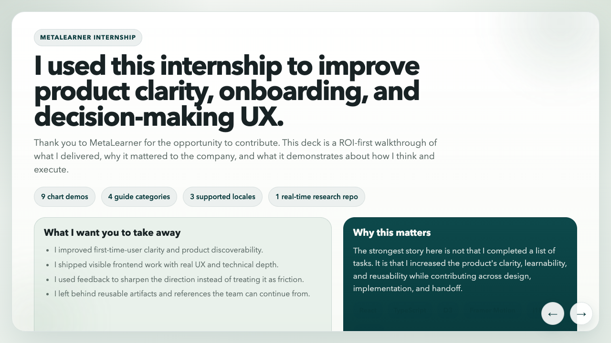

**9 demos. 4 guide categories. 3 locales. 1 real-time research repo.**

That is the cleanest way I know to introduce my MetaLearner internship now because it makes the shape of the work hard to flatten into "a few scattered tasks." The handoff site, chart gallery, redesign file, and research repo all point to the same thing: I was working on the layer between technical capability and actual product adoption.

MetaLearner had depth. That was the opportunity, but it was also the risk. A product like that can quietly lose people if the first path is unclear, if charts explain too little, or if too much product knowledge lives in the heads of support or field engineers instead of in the product itself. That is why my work ended up spanning guided onboarding, in-product docs, chart tooling, responsive frontend work, redesign exploration, and technical handoff. Different surfaces, same problem.

_This overview slide from the handoff deck is still the cleanest summary of the internship: product clarity, onboarding, and decision-making UX were the real center of gravity of the work._

## What MetaLearner actually is

For context, the main product story in MetaLearner is supply chain forecasting and planning. It is an AI-native product built on top of ERP data, with the goal of turning messy operational data into clearer forecasts, sharper demand planning, and faster supply chain decisions without asking teams to fight through spreadsheets, SQL, or extra technical overhead first.

In practical terms, that means MetaLearner combines ERP-connected forecasting surfaces, KPI dashboards, planning views, and AI agents that help teams ask questions, extract meaning from live data, and act earlier on operational risks.

That mission matters because it explains why the internship work clustered the way it did. If the product is supposed to make enterprise systems feel smarter and easier to use, then onboarding, documentation, chart quality, responsive layouts, and product direction are not side quests. They are part of whether the product's value becomes visible at all.

## Overview

The strongest way to tell this story is the same way I told it in the handoff deck: **ROI first, not chronology first**.

The internship made the most sense when ordered by company value:

1. **Highest immediate ROI**: onboarding and User Guide work that improved first-time-user clarity
2. **Most visible delivery**: a chart gallery that made MetaLearner's data surfaces more legible
3. **Longer-term direction**: Figma and UX work that gave the frontend a stronger system
4. **Future reuse**: research and handoff artifacts that reduced future ramp-up cost

That framing mattered because it let me explain the internship honestly. I was not only ticking off features. I was improving clarity, learnability, and reusability across design, implementation, and handoff.

## Why I split this into subposts

I did not want to compress MetaLearner into one neat retrospective and sand away the parts that make it credible. The parent post is the map. The subposts are where the shipped work becomes easier to inspect.

### 1. [Building self-serve onboarding inside MetaLearner](/blog/metalearner/onboarding)

This covers the onboarding modal, four-category User Guide, prompt-writing support, and why first-time-user clarity felt like the highest-ROI problem in the internship.

### 2. [Making MetaLearner charts easier to inspect](/blog/metalearner/charts)

This covers the `/graphs/*` gallery, the zoom and hover interaction layer, and the responsive frontend work that made MetaLearner's data surfaces easier to inspect.

### 3. [Using Figma to explore a clearer MetaLearner frontend](/blog/metalearner/redesign)

This covers the Figma redesign file, responsive explorations, chart direction, and the developing design system around components, typography, colours, primitives, and icons.

### 4. [Prototyping real-time ideas and leaving a usable handoff](/blog/metalearner/handoff)

This covers the Socket.IO research repo, the public handoff site, the future-only search references, and why a clean handoff is one of the last real deliverables of an internship.

## What held the work together

The shortest version is that I kept trying to lower cognitive load.

The onboarding work made the first path clearer. The User Guide turned that into repeatable product learning. The chart gallery made data surfaces more inspectable and more teachable. The Figma work gave those improvements a stronger long-term shape. The research repo and handoff assets made sure the future-facing parts of the internship would survive my exit.

That combination matters to me because it is one of the better examples I have of what product engineering looks like in a technical environment. It is not just building what the system can do. It is shaping how people enter it, read it, trust it, and pick it up after you are gone.

I also put together a separate public [handoff site / presentation](https://metalearner-internship-logs.vercel.app/) for the internship. That site is closer to a wrap-up document with reflections and links. This series is the version that tries to explain the product and engineering judgment behind the work.
