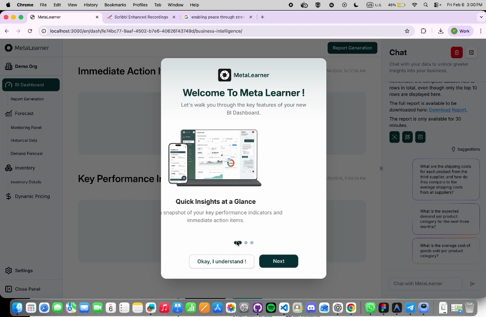

The highest-ROI problem in MetaLearner was first-time-user clarity.

That was the framing I used in the handoff deck, and after looking back through the implemented work, I still think it is the right one. This was not only a UX problem. If product value stays hidden behind vague first steps, adoption slows down, demos get weaker, and the team spends more time translating the product than extending it.

For context, the product asked users to understand ERP-backed forecasting surfaces, KPI dashboards, chart interactions, and an AI assistant for asking and extracting data. That is a lot of value, but it is also a lot of surface area to drop on someone too early.

## Problem framing

MetaLearner had enough surface area that weak onboarding would not fail in one dramatic way. It would fail gradually:

- setup would feel heavier than it needed to
- feature entry points would feel more ambiguous than they really were
- customers would need more hand-holding to become productive
- support and field engineers would absorb explanatory work that should have been designed out
- documentation would live outside the workflow instead of helping users move through it

That is why I think of onboarding here as infrastructure, not as a support layer sitting beside the product.

## What I actually shipped

The work in this track was more concrete than "better onboarding" makes it sound.

The onboarding flow itself included:

- an onboarding modal with **swipe gestures** and **step navigation**
- explanations tied to the **BI dashboard** and key product surfaces
- **"Find out more"** links into deeper guidance
- clearer sequencing so users could connect interface elements to product value
- implementation prepared to work alongside MetaLearner's language support

That then expanded into a fuller **User Guide system** inside the frontend repo. The guide was organized into four categories:

- **Dashboard Overview**
- **Drill Down into the Details**
- **Ask and Extract Your Data**
- **Settings**

What made the guide more than a static help page was that it also included:

- suggested questions for first-time usage
- examples of stronger and weaker prompts
- multi-turn conversation guidance for deeper extraction work
- content structured with i18n support in mind

The point was not only to explain the product. It was to reduce the amount of interpretation the user had to do before the product became useful.

_A real onboarding capture from the frontend: the BI dashboard remains visible in the background while the modal explains where to start and how to read the product._

## Why keeping the guidance in-product matters

One of the strongest lessons in this internship was that documentation gets dramatically better when it sits close to the decision it is trying to support.

If a user has to pause, leave the workflow, open a separate document, map the terminology back to the interface, and then return, that is already friction. In a complex product, enough small frictions turn into avoidance.

So the real value here was not that I "wrote docs." It was that the distance between confusion and help got shorter.

## Why this still feels like the core of the internship

This track clarified why I like this kind of work. It is not flashy in the way a brand-new feature can be, but it changes whether the rest of the product has a fair chance to succeed.

The best validation line from the handoff deck still captures it well:

> "I like the flow, especially the addition of user guide..."

That matters because it points to the real outcome. The work was not just visible. It was useful.
