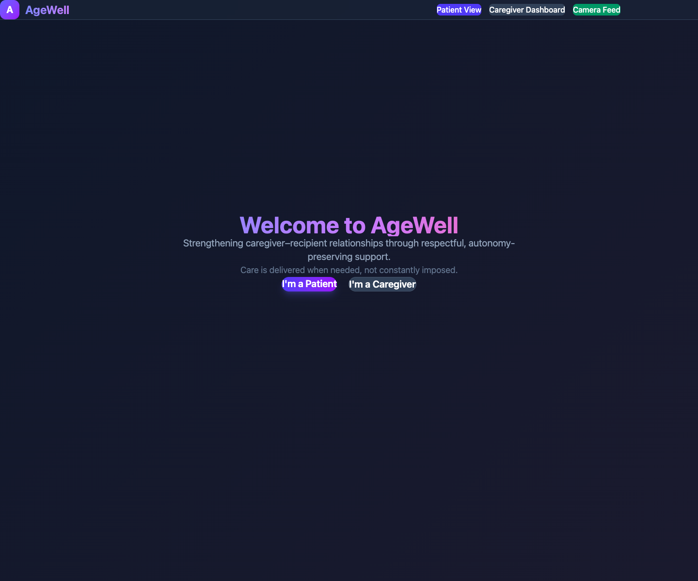
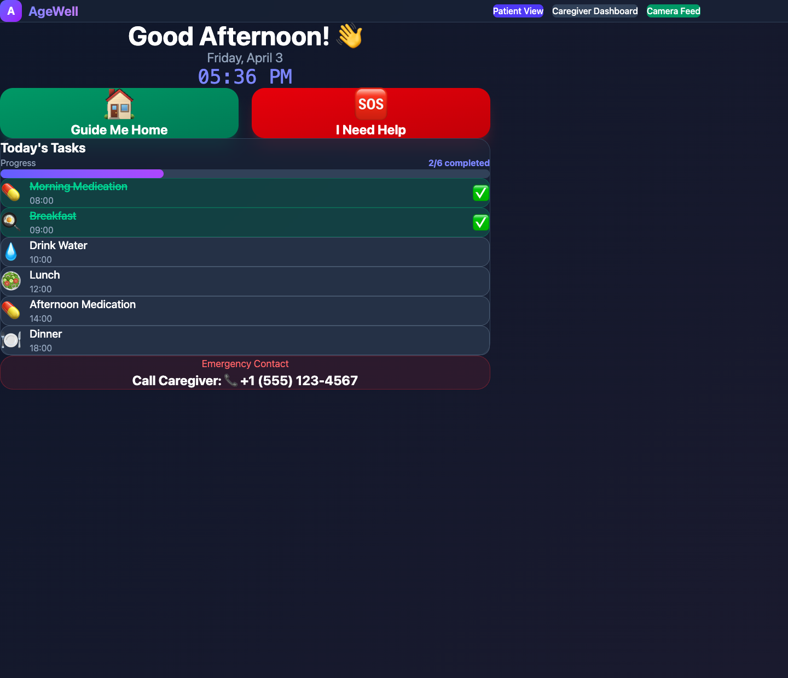
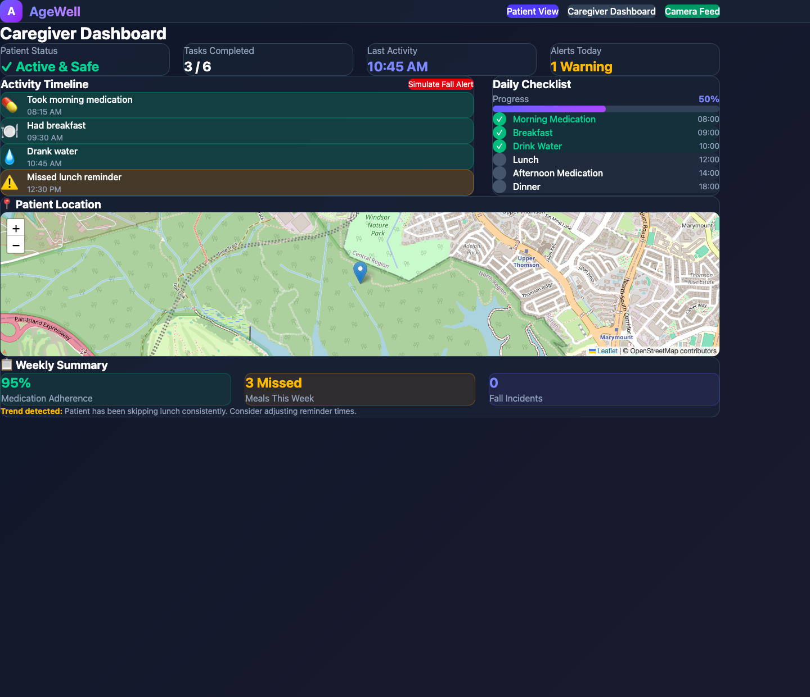
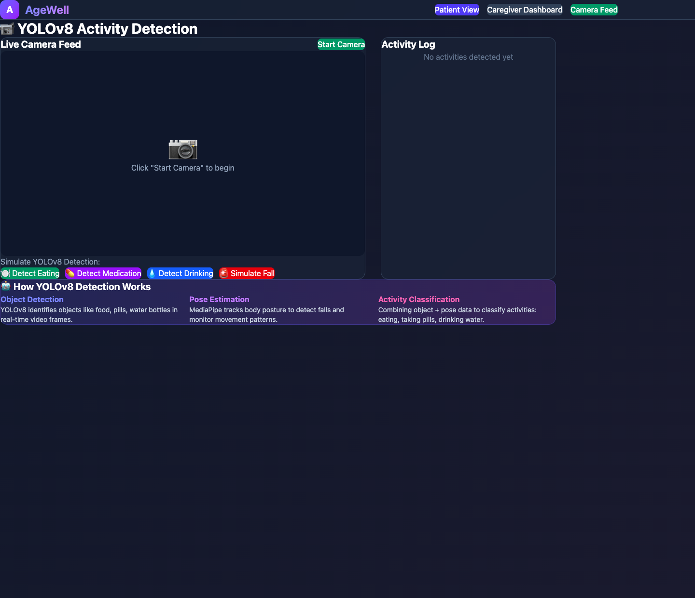

SafeStep started with a care loop that can quietly take over a relationship: Did you eat? Did you take your medication? Where are you? Are you safe?

The public submission called it **SafeStep**. The repo and PRD later called it **AgeWell**. The name changed, but the core idea did not: reduce caregiver anxiety without turning the care recipient into someone who feels watched all day.

That tension is why the project stayed with me. It is easy to build something technically capable and emotionally clumsy. It is much harder to build something useful that still preserves dignity.

## The problem felt human before it felt technical

The strongest part of the Devpost write-up was not the AI section. It was the description of what caregiving can feel like when everything slowly collapses into checking:

- Did you eat?
- Did you take your medication?
- Where are you?
- Are you safe?

Those are reasonable questions, but repeated often enough they start to reshape the relationship itself. Care becomes supervision. Concern becomes friction. The senior feels nagged. The caregiver feels guilty and exhausted.

That was the real problem we were trying to solve.

What made SafeStep interesting to me was that it was not pitching "more monitoring" as the answer. It was trying to shift the burden away from repeated human checking and toward quieter forms of support: verify routines automatically, raise alerts when something actually matters, and otherwise get out of the way.

## The product thesis was the real feature

This was submitted together with **Ivan Chua** and **Faith Lee**, and I think the best part of the project was that the feature set actually served one coherent idea instead of feeling like a pile of hackathon tricks.

The system covered a broad but believable care loop:

- fall detection with emergency escalation
- navigation support for seniors who might get lost
- checklist tracking for meals, hydration, and medication
- voice reminders that nudged instead of scolding
- caregiver dashboards and medical summaries

What I liked was that these were not random "AI features." They were all trying to answer the same product question: how do you support independence without forcing the caregiver to manually track everything?

The split between the two main surfaces mattered too. The senior-facing interface had to be clear, high-contrast, and low-friction. The caregiver-facing dashboard had to be richer in context. If both users were given the same surface, the product would have failed immediately.

  

    
  

  

    
  

## I worked on the backend, and it was my first real Node project

I worked on the backend for SafeStep, and this was my first time seriously using **Node.js**. That was a little intimidating at the time, which is honestly part of why I still remember the build so clearly.

What made it interesting was that the backend was not just a boring CRUD layer. Even in prototype form, it had to hold the logic that made the product feel like an actual care system:

- receive AI-detected activities from the Python service
- log events into an activity timeline
- auto-complete the right daily tasks when meals, hydration, or medication were detected
- expose patient status and progress to the caregiver dashboard
- accept location updates and fall alerts
- generate weekly summary data

That meant wiring together a simple **Express** API with a separate **Python** service that handled the computer-vision side using **YOLOv8** and **MediaPipe**. For a hackathon project, that was enough moving parts to feel very real very quickly.

I learned a lot from that. Not just about Node itself, but about how backend work changes when the job is to preserve trust. If the data is stale, the caregiver panics for no reason. If the alerts are noisy, the whole system becomes annoying. If the logic is unclear, the product starts feeling fake.

## The hard part was not adding more AI

The repo's core philosophy said it well: care should be delivered when needed, not constantly imposed.

That line stuck with me because it captures the actual difficulty here. A project like this does not become better just because it can detect more things. In fact, it can become worse. If the system escalates too aggressively, it becomes oppressive. If it is too passive, it misses real danger. If it is too visible, it undermines the independence it claims to protect.

So the real design challenge was not "how much AI can we fit in?" It was how to make the technology recede into the background until it was genuinely needed.

That is why the quieter features mattered as much as the dramatic ones. Fall detection gets the headline, but automatic meal verification, gentle reminders, and useful summaries are what actually turn the product from a demo into something that could change the emotional texture of care.

## What stayed with me

SafeStep stuck with me because it reminded me that social-impact software lives or dies on the quality of its restraint.

The easy version of elderly-care tech is surveillance with a nicer interface. The harder version is a system that gives caregivers reassurance while still letting the person being cared for feel capable. That second version is much more interesting to build, and much more worth building.

It also marked an early moment where I felt myself getting pulled toward product work that sits right between technical capability and human dignity. The backend taught me a lot, the hackathon pressure was fun in the usual chaotic way, but the thing I still remember most is the philosophy: build support that helps people feel less controlled, not more.

## Project links

- [Devpost submission](https://devpost.com/software/safesteps-9x4o7i)
- [GitHub repository](https://github.com/Ducksss/hack4good)
