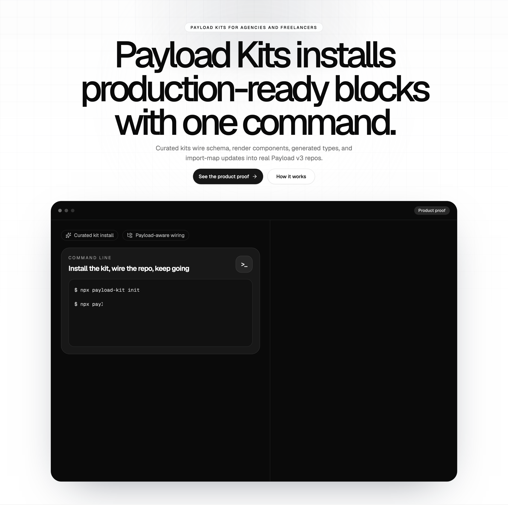
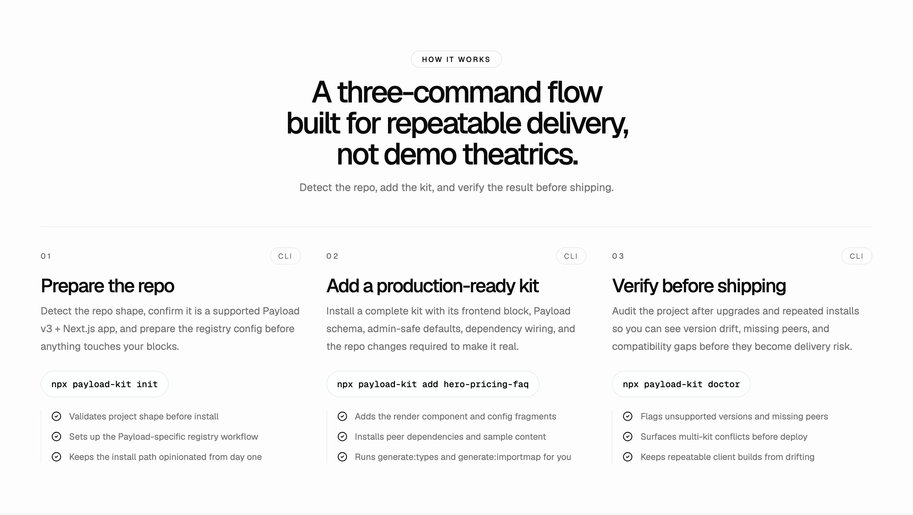
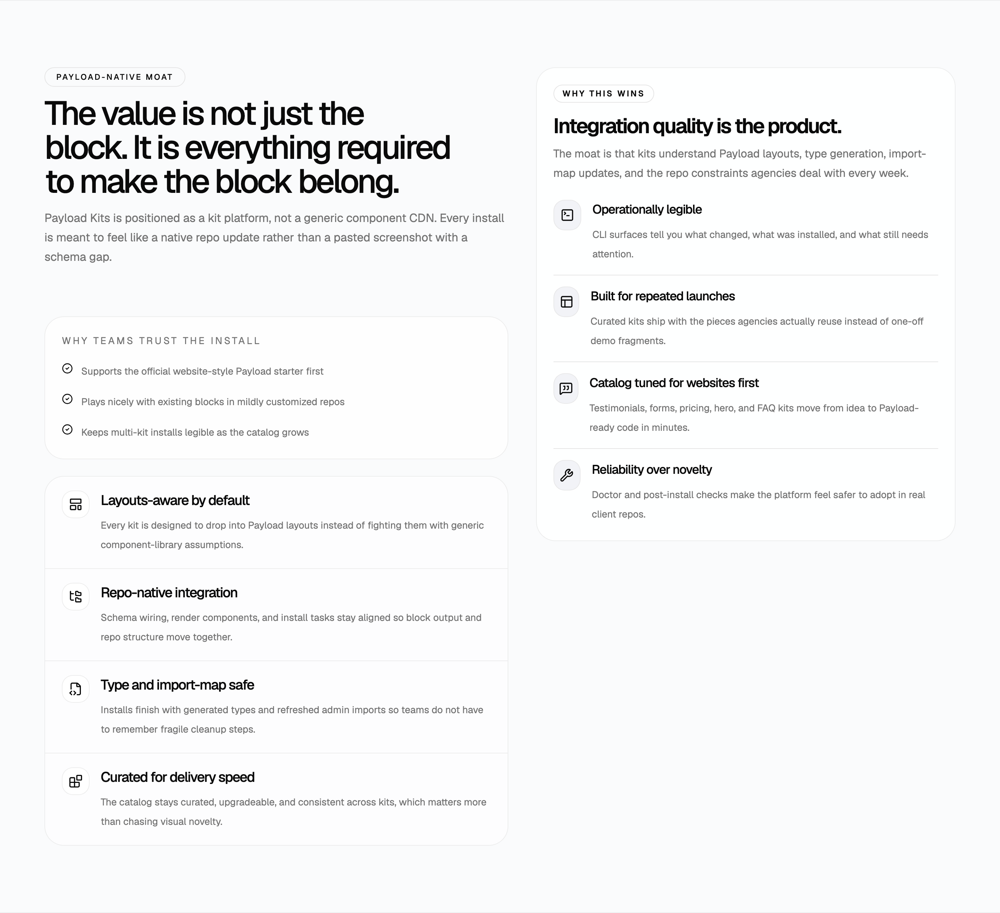

I kept running into the same problem while doing freelance work for [Genium](https://genium.sg/) and [Octilyon](https://octilyon.com/): the sites were different, but the block patterns were not. Heroes, pricing sections, FAQs, testimonials, forms, content slices, blog surfaces. The annoying part was not coming up with those blocks. The annoying part was how much Payload setup sat between "this is a common section" and "this repo can actually use it safely."

That gap kept bothering me because it made repeat work feel more bespoke than it really was. I did not mind building custom things when the product actually needed custom things. I minded rebuilding the same Payload glue over and over again just to get familiar website blocks into a working state. That frustration is basically where [Payload Kits](https://payload-components.xyz/) came from.

## The repeated pain was not the blocks themselves

What kept slowing me down was not visual design. It was the integration tax around every block.

In a real Payload v3 + Next.js repo, a reusable section is never just a JSX file sitting in `components/`. It usually drags a whole trail of setup behind it:

- the block schema and field config
- the frontend render component
- the imports that wire the block into the right place
- generated types that need to stay in sync
- import-map updates so Payload admin stays happy
- dependencies and repo-specific setup that only become obvious once you are halfway through the install

Any one of these steps is reasonable on its own. The problem is repetition. By the third or fourth client build, it starts feeling a bit stupid that I can know exactly what shape I want and still have to manually reconstruct the same infrastructure around it.

That was especially obvious on blog and marketing-style builds. I was not trying to invent a new CMS pattern every week. I was trying to ship polished sites quickly without treating every hero block like a fresh research problem.

## Why I built Payload Kits

Payload Kits is my attempt to make that repeat work less annoying.

I do not want this to be a generic component gallery where people copy screenshots and then figure out the hard part themselves. I want it to be a Payload-native kit platform. The difference matters. The useful part is not "here is a nice testimonial section." The useful part is "here is a testimonial section that installs into a real Payload repo with the schema, render component, type generation, and project wiring handled in a predictable way."

That is why the current site at [payload-components.xyz](https://payload-components.xyz/) is framed around **Payload Kits** instead of around a generic "component marketplace" idea. The product promise I care about is very simple: install production-ready Payload block kits with one command.

The site is still early, but the direction is not vague. I want a tool that feels like it actually understands the environment it is entering instead of dumping files into your repo and calling it a day.

## What it aims to do

The core workflow I want to build around is pretty straightforward:

- `npx payload-kit init`
- `npx payload-kit add <kit-name>`
- `npx payload-kit doctor`

`npx payload-kit init` should detect the project shape, confirm that the repo is actually a supported Payload setup, and prepare the local config needed for kit installs.

`npx payload-kit add <kit-name>` should do the real work: pull the selected kit, install dependencies, add the files that belong in the repo, wire the block into Payload, and run the follow-up tasks like type generation and import-map updates.

`npx payload-kit doctor` exists because I do not trust happy-path demos as a product strategy. If this is meant for real agency or freelancer repos, the tool needs to validate compatibility, catch drift, and help people understand why something broke after an upgrade or a partial manual edit.

The main goal is to ship complete kits, not loose fragments. A good kit should come with the block config, the frontend renderer, the metadata needed to install it properly, and the repo updates required to make it feel native instead of stapled on.

## Who it is really for

I am building this for agencies and freelancers first because that is the workflow pressure that made the idea real for me.

If you are shipping a lot of client websites, the same families of sections keep coming back. Not in exactly the same visual style, obviously, but in the same structural shape:

- hero sections
- feature grids
- pricing blocks
- FAQ blocks
- testimonial sections
- newsletter or contact forms
- about or team sections
- stats and content rows

That is a very different problem from building a one-off custom product UI. In agency work, speed matters, but so does reliability. You do not just need something that looks good in isolation. You need something that can drop into a real client repo without making the project more fragile.

That is also why I do not think the right comparison is a normal UI component library. The moment content editors, Payload layouts, admin tooling, generated types, and repo conventions enter the picture, the install problem changes shape.

## The real moat is Payload-native integration

I do not think the moat here is visual novelty. A prettier hero block is nice, but it is not the hard part.

The hard part is integration quality:

- installs that understand Payload layouts
- generated types that still line up afterwards
- import-map awareness
- preview-friendly defaults
- upgrade paths that do not quietly trash existing repo work
- checks that make the tool feel safer to use on client codebases

That is why the current direction leans so hard into ideas like conflict-aware upgrades and doctor checks. If a repo already has its own blocks, I do not want the tool to bulldoze through that reality. I want it to help with a clean merge story.

To me, that is the actual product thesis: the useful thing is not "component distribution" in the abstract. The useful thing is reliable, Payload-aware installation into codebases that already have history, conventions, and sharp edges.

## What I do not want this to become

I want v1 to stay narrow on purpose.

I do not want this to become:

- a broad user-generated marketplace
- a support-everything tool for every frontend stack
- a compatibility promise across every Payload version
- a visual novelty contest where the integration story becomes secondary

The version I care about first is much more opinionated than that. I want it focused on Payload v3, Next.js App Router repos, and the repeat-use website blocks that agencies and freelancers actually keep rebuilding. If that narrower version is not solid, then a bigger version is just a larger mess.

Honestly, this is the product I kept wishing existed while I was doing this work for clients. I wanted something that respected how repetitive the problem really was without pretending the integration details did not matter. Payload Kits is my attempt to build that missing layer, and [payload-components.xyz](https://payload-components.xyz/) is the first public home for it.

## Links

- [Payload Kits](https://payload-components.xyz/)
